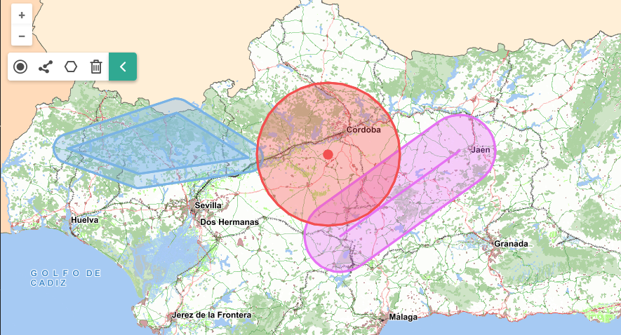

# M.plugin.Buffer

Plugin que genera un buffer o un área de influencia sobre un punto, linea o polígono que se dibuje sobre el mapa y con una equidistancia determinada.



## Dependencias

- buffer.ol.min.js
- buffer.ol.min.css


```html
 <link href="../../plugins/buffer/buffer.ol.min.css" rel="stylesheet" />
 <script type="text/javascript" src="../../plugins/buffer/buffer.ol.min.js"></script>
```

## Parámetros

- El constructor se inicializa con un JSON de _options_ con los siguientes atributos:

- **position**. Indica la posición donde se mostrará el plugin
    - 'TL':top left
    - 'TR':top right (default)
    - 'BL':bottom left
    - 'BR':bottom right

- **collapsible**. Si es *true*, el botón aparece, y puede desplegarse y contraerse. Si es *false*, el botón no aparece. Por defecto tiene el valor *true*.

- **collapsed**. Si es *true*, el panel aparece cerrado. Si es *false*, el panel aparece abierto. Por defecto tiene el valor *true*.

## Ejemplos de uso

### Ejemplo 1
```javascript
   const map = M.map({
     container: 'map'
   });

   const mp = new M.plugin.Buffer({
        position: 'TL',
      });

   map.addPlugin(mp);
```
### Ejemplo 2
```javascript
const mp = new M.plugin.Buffer({
  position: 'BR',
  collapsible: false
});

map.addPlugin(mp);
```
### Ejemplo 3
```javascript
const mp = new M.plugin.Buffer({});

map.addPlugin(mp);
```
