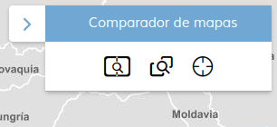
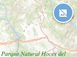

<p align="center">
  
</p>
<h1 align="center"><strong>APICNIG</strong> <small>🔌 M.plugin.Comparators</small></h1>

<p align="center">
  <a title="MIT License" href="LICENSE">
    
  </a>
  <a title="Node version" href="https://nodejs.org/es">
    
  </a>  
  <a title="NPM version" href="https://www.npmjs.com/package/npm">
    
  </a>
  <a title="Language" href="https://www.w3schools.com/html/" target="_blank">
    
  </a>  
  <a title="Language" href="https://www.w3schools.com/js/" target="_blank">
    
  </a>
  <a title="Language" href="https://www.w3schools.com/css/" target="_blank">
    
  </a>

  <br />
  <br />
</p>

## Descripción 👷

Plugin que agrupa los diversos plugins comparadores en una misma herramienta.

|  Herramienta abierta  |Herramienta cerrada
|:----:|:----:|
|||


Los modos de comparación son: Cortina, "spy eye" y modo espejo.

## Dependencias 👷

- comparepanel.ol.min.js
- comparepanel.ol.min.css


```html
 <link href="../../plugins/comparators/comparators.ol.min.css" rel="stylesheet" />
 <script type="text/javascript" src="../../plugins/comparators/comparators.ol.min.js"></script>
```


## Modos de comparación

<p align="center">
  
</p>

**Comparador de espejo / Mirror**: permite comparar varias capas dividiendo la pantalla en varias partes. Los mapas tienen sus vistas sincronizadas, y podemos ver la representación de una misma zona por distintas capas.

**Comparador de cortina / Curtain**: permite comparar varias capas sobre una cartografía base. La extensión de las capas sobre lienzo vienen definidas por la posición del ratón o por el punto medio del lienzo.

**Comparador zonal / Spyeye**: reducción de la capa comparativa a una zona circular para contratarla con el mapa de fondo.

## Parámetros

El constructor se inicializa con un JSON de options con los siguientes atributos:

- **position**: Indica la posición donde se mostrará el plugin.
  - 'TL': (top left) - Arriba a la izquierda.
  - 'TR': (top right) - Arriba a la derecha (por defecto).
  - 'BL': (bottom left) - Abajo a la izquierda.
  - 'BR': (bottom right) - Abajo a la derecha.

- **collapsed**: Indica si el plugin viene colapsado de entrada (true/false). Por defecto: true.

- **collapsible**: Indica si el plugin puede abrirse y cerrarse (true) o si permanece siempre abierto (false). Por defecto: true.


- **listLayers**: Array de capas (String o Object), estas capas se verán en el selector.
```JavaScript
// Ejemplos de definiciones de capas esperadas por el
// comparador en formato StringLayer

/* WMS */
[
  'WMS*Huellas Sentinel2*https://wms-satelites-historicos.idee.es/satelites-historicos*teselas_sentinel2_espanna*true',
  'WMS*Invierno 2022 falso color natural*https://wms-satelites-historicos.idee.es/satelites-historicos*SENTINEL.2022invierno_432-1184*true',
  'WMS*Invierno 2022 falso color infrarrojo*https://wms-satelites-historicos.idee.es/satelites-historicos*SENTINEL.2022invierno_843*true',
  'WMS*Filomena*https://wms-satelites-historicos.idee.es/satelites-historicos*Filomena*true',
]

 /* WMTS */
[
  'WMTS*https://www.ign.es/wmts/mapa-raster*MTN*GoogleMapsCompatible*Mapa MTN*image/jpeg',
  'WMTS*https://www.ign.es/wmts/primera-edicion-mtn?*mtn50-edicion1*GoogleMapsCompatible*MTN50 1Edi*image/jpeg',
  'WMTS*https://www.ign.es/wmts/mapa-raster*MTN_Fondo*GoogleMapsCompatible*MTN Fondo*image/jpeg',
  'WMTS*https://www.ign.es/wmts/pnoa-ma?*OI.OrthoimageCoverage*GoogleMapsCompatible*Imagen (PNOA)*image/jpeg',
]
```
- **defaultCompareMode**: Indica el modo de comparación que se arranca por defecto.
  - 'mirror': Comparador de espejo.
  - 'curtain': Comparador de paneles móviles.
  - 'spyeye': Comparador de zona o puntual.
  - 'none': no arranca ninguno de los comparadores.

- **enabledKeyFunctions**:  
Comparación en modo espejo:
Si es true, se pueden usar las combinaciones de teclas Ctrl + Shift + [F1-F8] para cambiar entre los distintos modos de visualización. Con la tecla Escape se destruye el plugin.  <br>
Comparación en modo spyeye:
Ctrl + Shift + Enter: Alterna el estado de congelación.  
Ctrl + Shift + Flecha hacia arriba: Aumenta el radio, si el radio alcanza el valor máximo de 200, no ocurre ningún cambio.  
Ctrl + Shift + Flecha hacia abajo: Disminuye el radio, si el radio llega al valor mínimo de 32, no ocurre ningún cambio.  

- **lyrsMirrorMinZindex**: Indica el nivel zIndex a partir del cual se cargan las capas superpuestas en los comparadores espejo. Por defecto, tiene valor de 50.

- **isDraggable**: "True" para que el plugins se pueda desplazar, por defecto false.

- **transparencyParams**: Parámetros opcionales del control transparency.
  - radius (numérico): radio del efecto transparencia. Tiene un rango entre 30 y 200. Defecto: 100.
  - maxRadius Radio máximo, por defecto 200.
  - minRadius: Radio mínimo, por defecto 30.
  - tooltip: Valor a usar para mostrar en el tooltip del control, por defecto Transparencia / Transparency.

- **lyrcompareParams**: Parámetros opcionales del plugin lyrcompare.
  - defaultLyrA (numérico): Capa cargada al inicio en posición 1. Valores de 1 al número de capas disponibles. Defecto, 1.
  - defaultLyrB (numérico): Capa cargada al inicio en posición 2. Valores de 1 al número de capas disponibles. Defecto, 2.
  - defaultLyrC (numérico): Capa cargada al inicio en posición 3. Valores de 1 al número de capas disponibles. Defecto, 3.
  - defaultLyrD (numérico): Capa cargada al inicio en posición 4. Valores de 1 al número de capas disponibles. Defecto, 4.
  - opacityVal: Define el valor de la opacidad que se aplicará a las capas que se muestran sobre la cartografía base. Rango 0 a 100.
  - staticDivision: Permite definir si al arrancar la herramienta dividirá las capas por la posición del ratón (valor 0), por el punto medio del lienzo de cartografía (valor 1) o por el punto medio del lienzo de cartografía con líneas arrastrables (valor 2). Por defecto toma el valor 1.
  - tooltip: Valor a usar para mostrar en el tooltip del control, por defecto Comparador de capas / Layer Comparison.
  - defaultCompareViz: Modo de visualización, indicamos de 0 a 3.
    - 0: barra de herramientas desplegada con el mapa simple esperando al usuario.
    - 1: dos mapas en vertical.
    - 2: dos mapas en horizontal.
    - 3: cuatro mapas.

- **mirrorpanelParams**: Parámetros opcionales del plugin mirrorpanel. A destacar:
  - showCursors (true/false): Si es true, muestra cursores sincronizados en cada unao de los mapas espejo. Defecto: *true*.
  - principalMap (true/false): indica en qué posición de la pantalla se mantiene el mapa principal (el que contiene el botón con las herramientas de comparación) con respecto a los demás. *False*: se sitúa a la izquierda. *True*: se sitúa a la derecha. Defecto: *false*.
  - enabledControlsPlugins: Define los plugins y controles que irán en cada mapa. Es necesario hacer las importaciones CDN de los diferentes plugins.
  ⚠️ Por API-REST solo funcionarán los plugins que se hayan cargado en el mapa principal.
  ⚠️ El método getAPIRestBase64 solo funcionará si se le pasa las capas a los plugins en formato String.
  - enabledDisplayInLayerSwitcher: Define si se incluirán en el selector de capas las capas con displayInLayerSwitcher *true*.
  - modeVizTypes: Define los modos de comparación.
  - tooltip: Valor a usar para mostrar en el tooltip del control, por defecto Comparador de mapas espejo / Mirror Comparison.
  - defaultCompareViz: Modo de visualización, indicamos de 0 a 9 el modo de visualización:
    - 0: barra de herramientas desplegada con el mapa simple esperando al usuario.
    - 1: dos mapas en vertical.
    - 2: dos mapas en horizontal.
    - 3: tres mapas en vertical.
    - 4: cuatro mapas en vertical.
    - 5: mosaico con cuatro mapas.
    - 6: cuatro mapas en horizontal.
    - 7: tres mapas en proporción 2-1-1.
    - 8: un mapa arriba y dos abajo.
    - 9: dos mapas arriba y uno abajo.
## Ejemplo

Insertar intervalos a través de servicios WMS. La URL en formato API-CORE sigue la siguiente estructura:
  - Servicio,Leyenda,URL,Nombre. Separados por "*".
```javascript
 const mp = new Comparators({
  position: 'TR',
  collapsed: false,
  collapsible: true,
  defaultCompareMode: 'mirror', // mirror - curtain - spyeye - none
  listLayers: [
    'WMS*Huellas Sentinel2*https://wms-satelites-historicos.idee.es/satelites-historicos*teselas_sentinel2_espanna*true',
    'WMS*Invierno 2022 falso color natural*https://wms-satelites-historicos.idee.es/satelites-historicos*SENTINEL.2022invierno_432-1184*true',
    'WMS*Invierno 2022 falso color infrarrojo*https://wms-satelites-historicos.idee.es/satelites-historicos*SENTINEL.2022invierno_843*true',
    'WMS*Filomena*https://wms-satelites-historicos.idee.es/satelites-historicos*Filomena*true',
  ],
  enabledKeyFunctions: true,
  lyrsMirrorMinZindex: 10,
  transparencyParams: {
    radius: 50,
    maxRadius: 100,
    minRadius: 10,
    tooltip: 'tooltipTransparency',
  },
  lyrcompareParams: {
    staticDivision: 2,
    defaultLyrA: 3,
    defaultLyrB: 2,
    defaultLyrC: 1,
    defaultLyrD: 0,
    opacityVal: 100,
    tooltip: 'tooltipLyrCompare',
    defaultCompareViz: 2,
  },
  mirrorpanelParams: {
    showCursors: false,
    principalMap: true,
    enabledControlsPlugins: {
      map2: {
        ShareMap: {}, // Opciones por defecto
      },
      map3: {
        constrols: ['scale'],
        FullTOC: {
          position: 'TL',
        },
      },
      map4: {
        FullTOC: {
          position: 'TL',
        },
        BackImgLayer: {
          position: 'TR',
          collapsible: true,
          collapsed: true,
          layerId: 0,
          columnsNumber: 2,
          layerVisibility: true,
          layerOpts: [{
            id: 'mapa',
            preview: 'plugins/backimglayer/images/svqmapa.png', // ruta relativa, edite por la deseada
            title: 'Mapa',
            layers: [new M.layer.WMTS({
              url: 'http://www.ign.es/wmts/ign-base?',
              name: 'IGNBaseTodo',
              legend: 'Mapa IGN',
              matrixSet: 'GoogleMapsCompatible',
              transparent: false,
              displayInLayerSwitcher: false,
              queryable: false,
              visible: true,
              format: 'image/jpeg',
            })],
          },
          {
            id: 'imagen',
            title: 'Imagen',
            preview: 'plugins/backimglayer/images/svqimagen.png', // ruta relativa, edite por la deseada
            layers: [new M.layer.WMTS({
              url: 'http://www.ign.es/wmts/pnoa-ma?',
              name: 'OI.OrthoimageCoverage',
              legend: 'Imagen (PNOA)',
              matrixSet: 'GoogleMapsCompatible',
              transparent: false,
              displayInLayerSwitcher: false,
              queryable: false,
              visible: true,
              format: 'image/jpeg',
            })],
          },
          {
            id: 'hibrido',
            title: 'Híbrido',
            preview: 'plugins/backimglayer/images/svqhibrid.png', // ruta relativa, edite por la deseada
            layers: [new M.layer.WMTS({
              url: 'http://www.ign.es/wmts/pnoa-ma?',
              name: 'OI.OrthoimageCoverage',
              legend: 'Imagen (PNOA)',
              matrixSet: 'GoogleMapsCompatible',
              transparent: true,
              displayInLayerSwitcher: false,
              queryable: false,
              visible: true,
              format: 'image/png',
            }),
            new M.layer.WMTS({
              url: 'http://www.ign.es/wmts/ign-base?',
              name: 'IGNBaseOrto',
              matrixSet: 'GoogleMapsCompatible',
              legend: 'Mapa IGN',
              transparent: false,
              displayInLayerSwitcher: false,
              queryable: false,
              visible: true,
              format: 'image/png',
            }),
            ],
          },
          {
            id: 'lidar',
            preview: 'plugins/backimglayer/images/svqlidar.png', // ruta relativa, edite por la deseada
            title: 'LIDAR',
            layers: [new M.layer.WMTS({
              url: 'https://wmts-mapa-lidar.idee.es/lidar?',
              name: 'EL.GridCoverageDSM',
              legend: 'Modelo Digital de Superficies LiDAR',
              matrixSet: 'GoogleMapsCompatible',
              transparent: false,
              displayInLayerSwitcher: false,
              queryable: false,
              visible: true,
              format: 'image/png',
            })],
          },
          ],
        },
      },
    },
    enabledDisplayInLayerSwitcher: true,
    defaultCompareViz: 2,
    modeVizTypes: [0, 1, 2, 3, 5], // 0 - 9
    tooltip: 'tooltipMirror',
  },
});

   map.addPlugin(mp);
```

## 👨‍💻 Desarrollo

Para el stack de desarrollo de este componente se ha utilizado

* NodeJS Version: 14.16
* NPM Version: 6.14.11
* Entorno Windows.

## 📐 Configuración del stack de desarrollo / *Work setup*


### 🐑 Clonar el repositorio / *Cloning repository*

Para descargar el repositorio en otro equipo lo clonamos:

```bash
git clone [URL del repositorio]
```

### 1️⃣ Instalación de dependencias / *Install Dependencies*

```bash
npm i
```

### 2️⃣ Arranque del servidor de desarrollo / *Run Application*

```bash
npm run start
```

## 📂 Estructura del código / *Code scaffolding*

```any
/
├── assets 🌈               # Recursos
├── src 📦                  # Código fuente.
├── task 📁                 # EndPoints
├── test 📁                 # Testing
├── tmp 📁                  # Destination directory for images.
├── webpack-config 📁       # Webpack configs.
└── ...
```
## 📌 Metodologías y pautas de desarrollo / *Methodologies and Guidelines*

Metodologías y herramientas usadas en el proyecto para garantizar el Quality Assurance Code (QAC)

* ESLint
  * [NPM ESLint](https://www.npmjs.com/package/eslint)
  * [NPM ESLint | Airbnb](https://www.npmjs.com/package/eslint-config-airbnb)

## ⛽️ Revisión e instalación de dependencias / *Review and Update Dependencies*

Para la revisión y actualización de las dependencias de los paquetes npm es necesario instalar de manera global el paquete/ módulo "npm-check-updates".

```bash
# Install and Run
$npm i -g npm-check-updates
$ncu
```

## 🚔 Licencia

* [European Union Public Licence v1.2](https://raw.githubusercontent.com/JoseJPR/tutorial-nodejs-cli-system-notification/main/README.md)