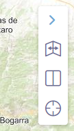

# M.plugin.Comparepanel

Plugin de línea del tiempo



# Dependencias

- comparepanel.ol.min.js
- comparepanel.ol.min.css


```html
 <link href="../../plugins/comparepanel/comparepanel.ol.min.css" rel="stylesheet" />
 <script type="text/javascript" src="../../plugins/comparepanel/comparepanel.ol.min.js"></script>
```

# Parámetros

- El constructor se inicializa con un JSON de options con los siguientes atributos:

- **intervals**. Parámetro obligatorio. Array que contiene cada capa junto a sus datos:
  - Nombre: nombre descriptivo de la capa.
  - Etiqueta: etiqueta o fecha de la capa.
  - Servicio en formato mapea para insertar una capa a través de servicios WMS ó WMTS, o la capa como objeto, de cada intervalo.

- **position**. Indica la posición donde se mostrará el plugin.
  - 'TL':top left
  - 'TR':top right (default)
  - 'BL':bottom left
  - 'BR':bottom right

# Ejemplos de uso

## Ejemplo
Insertar intervalos a través de servicios WMS. La URL en formato mapea sigue la siguiente estructura:
  - Servicio,Leyenda,URL,Nombre. Separados por "*".
```javascript
  const mp = new M.plugin.Comparepanel({
  position: 'TL',
  intervals: [
    ["NACIONAL 1981-1986", "1986", "WMS*NACIONAL_1981-1986*https://www.ign.es/wms/pnoa-historico*NACIONAL_1981-1986"],
    ["OLISTAT", "1998", "WMS*OLISTAT*https://www.ign.es/wms/pnoa-historico*OLISTAT"],
    ["SIGPAC", "2003", "WMS*SIGPAC*https://www.ign.es/wms/pnoa-historico*SIGPAC"],
    ["PNOA 2004", "2004", "WMS*pnoa2004*https://www.ign.es/wms/pnoa-historico*pnoa2004"],
    ["PNOA 2005", "2005", "WMS*pnoa2005*https://www.ign.es/wms/pnoa-historico*pnoa2005"],
    ["PNOA 2006", "2006", "WMS*pnoa2006*https://www.ign.es/wms/pnoa-historico*pnoa2006"],
    ["PNOA 2010", "2010", "WMS*pnoa2010*https://www.ign.es/wms/pnoa-historico*pnoa2010"]
  ]
});

   map.addPlugin(mp);
```
