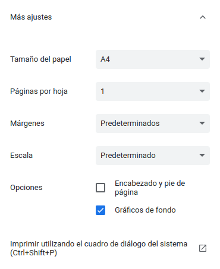

<p align="center">
  
</p>
<h1 align="center"><strong>APICNIG</strong> <small>🔌 M.plugin.Help</small></h1>

# Descripción

Obtiene la ayuda de cada herramienta (plugins y controles), si la tiene disponible), y la muestra en una página HTML.
Además permite mostrar contenido extra indicado por el usuario antes y/o después de la ayuda de las herramientas.
También permite descargar la ayuda en formato PDF.

# Dependencias

Para que el plugin funcione correctamente es necesario importar las siguientes dependencias en el documento html:

- **help.ol.min.js**
- **help.ol.min.css**


```html
 <link href="https://componentes.cnig.es/api-core/plugins/help/help.ol.min.css" rel="stylesheet" />
 <script type="text/javascript" src="https://componentes.cnig.es/api-core/plugins/help/help.ol.min.js"></script>
```

# Uso del histórico de versiones

Existe un histórico de versiones de todos los plugins de API-CNIG en [api-ign-legacy](https://github.com/IGN-CNIG/API-CNIG/tree/master/api-ign-legacy/plugins) para hacer uso de versiones anteriores.
Ejemplo:
```html
 <link href="https://componentes.cnig.es/api-core/plugins/help/help-1.0.0.ol.min.css" rel="stylesheet" />
 <script type="text/javascript" src="https://componentes.cnig.es/api-core/plugins/help/help-1.0.0.ol.min.js"></script>
```


# Parámetros

El constructor se inicializa con un JSON con los siguientes atributos:

- **position**: Indica la posición donde se mostrará el plugin.
  - 'TL': (top left) - Arriba a la izquierda.
  - 'TR': (top right) - Arriba a la derecha (por defecto).
  - 'BL': (bottom left) - Abajo a la izquierda.
  - 'BR': (bottom right) - Abajo a la derecha.
- **tooltip**: Tooltip que se muestra sobre el plugin (Se muestra al dejar el ratón encima del plugin como información). Por defecto: 'Ayuda'.
- **header**: Objeto para indicar:
  - **images**: Array de URLs de imágenes para mostrar en la cabecera. Por defecto:
    ['https://componentes.cnig.es/api-core/img/logo_ge.svg', 'https://componentes.cnig.es/api-core/img/ign.svg']
  - **title**: Título para mostrar en la cabecera. Por defecto: 'Ayuda API-CNIG'.
- **initialIndex**: Indica en que índice se abrira la página de ayuda.
- **initialExtraContents**: Contenido extra para mostrar antes de la ayuda de las herramientas. Permite un array de objetos con el siguiente formato:
  [{title: 'Texto', content: 'HTML en formato texto'}].
  El objeto también puede contener subcontenido que consiste en un array de objetos. Ejemplo:
  ```javascript
    [
      {
        title: 'Texto',
        content: 'HTML en formato texto',
        subContents: [{title: 'Texto 2', content: 'HTML en formato texto 2'}]
    },
  ]
  ```
    
  En caso de desear implementar varios idiomas el parámetro initialExtraContents permitirá recibir un objeto con los diferentes idiomas. Ejemplo:
  ```javascript
    {
      es: [{ title: 'Texto en español', content: 'HTML en formato texto en español' }],
      en: [{ title: 'Texto en inglés', content: 'HTML en formato texto en inglés' }]
    }
  ```
    
  Nota: mostará el idioma del visualizador.
- **finalExtraContents**: funciona igual que initialExtraContents.
- **extendInitialExtraContents**: Booleano que permite extender el contenido inicial con información definida de la API-CNIG. Por defecto: true.

# API-REST

```javascript
URL_API?help=position*tooltip*extendInitialExtraContents
```

<table>
  <tr>
    <th>Parámetros</th>
    <th>Opciones/Descripción</th>
    <th>Disponibilidad</th>
  </tr>
  <tr>
    <td>position</td>
    <td>TR/TL/BR/BL</td>
    <td>Base64 ✔️ | Separador ✔️</td>
  </tr>
  <tr>
    <td>tooltip</td>
    <td>Texto informativo</td>
    <td>Base64 ✔️ | Separador ✔️</td>
  </tr>
  <tr>
    <td>header</td>
    <td>Cabecera para la página de ayuda</td>
    <td>Base64 ✔️ | Separador ❌</td>
  </tr>
    <tr>
    <td>initialExtraContents</td>
    <td>Contido para añadir antes de la ayuda de las herramientas</td>
    <td>Base64 ✔️ | Separador ❌</td>
  </tr>
  <tr>
    <td>finalExtraContents</td>
    <td>Contido para añadir después de la ayuda de las herramientas</td>
    <td>Base64 ✔️ | Separador ❌</td>
  </tr>
  <tr>
    <td>extendInitialExtraContents</td>
    <td>Permite extender el parámetro initialExtraContents con información definida de la API-CNIG.</td>
    <td>Base64 ✔️ | Separador ✔️</td>
  </tr>
</table>


### Ejemplo de uso API-REST

```
https://componentes.cnig.es/api-core/?help=TR*Obtener%20ayuda*true
```

### Ejemplo de uso API-REST en base64

Para la codificación en base64 del objeto con los parámetros del plugin podemos hacer uso de la utilidad M.utils.encodeBase64.
Ejemplo:
```javascript
M.utils.encodeBase64(obj_params);
```

Ejemplo del constructor:
```javascript
{
  position: "TR",
  tooltip: "Obtener ayuda",
}
```
```
https://componentes.cnig.es/api-core/?help=base64=ewogIHBvc2l0aW9uOiAiVFIiLAogIHRvb2x0aXA6ICJPYnRlbmVyIGF5dWRhIiwKfQ==
```

# Ejemplo de uso

```javascript
const mp = new M.plugin.Help({
  position: 'BL',
  tooltip: 'Obtener ayuda',
  images: [
    'https://www.ign.es/iberpix/static/media/logo.72e2e78b.png',
  ],
  title: 'Título definido por el usuario',
  extendInitialExtraContents: true,
  initialExtraContents: [
    { title: 'Apartado 1', content: '<div><h2 style="text-align: center; color: #fff; background-color: #364b5f; padding: 8px 10px;">Mi primer apartado</h2><div><p>Contenido extra definido por el usuario</p></div></div>',
    }
  ],
  finalExtraContents: [
    { title: 'Apartado final', content: '<div><h2 style="text-align: center; color: #fff; background-color: #364b5f; padding: 8px 10px;">Apartado final</h2><div><p>Contenido extra definido por el usuario</p></div></div>',
    }
  ]
});
```

# Configuración

## Estilo de título

Las herramientas disponen de un estilo en el título para que aparezca más destacado que el contenido.
Si se desea indicar en el contenido extra que añada el usuario se debe añadir la siguiente regla css en el elemento del título, normalmente en la etiqueta h2:

  style="text-align: center; color: #fff; background-color: #364b5f; padding: 8px 10px;"

## Más ajustes de impresión

Cuando pulsamos en el botón para descargar el contenido en PDF podemos realizar más ajustes antes de generar el documento. Para ello, en la ventana que se abre al pulsar el botón, podemos acceder a "Más ajustes".

||

## Tamaño de imágenes

Se recomienda no utilizar imágenes que pesen más de 1,5 MB.


# 👨‍💻 Desarrollo

Para el stack de desarrollo de este componente se ha utilizado

* NodeJS Version: 14.16
* NPM Version: 6.14.11
* Entorno Windows.

## 📐 Configuración del stack de desarrollo / *Work setup*


### 🐑 Clonar el repositorio / *Cloning repository*

Para descargar el repositorio en otro equipo lo clonamos:

```bash
git clone [URL del repositorio]
```

### 1️⃣ Instalación de dependencias / *Install Dependencies*

```bash
npm i
```

### 2️⃣ Arranque del servidor de desarrollo / *Run Application*

```bash
npm run start
```

## 📂 Estructura del código / *Code scaffolding*

```any
/
├── src 📦                  # Código fuente
├── task 📁                 # EndPoints
├── test 📁                 # Testing
├── webpack-config 📁       # Webpack configs
└── ...
```
## 📌 Metodologías y pautas de desarrollo / *Methodologies and Guidelines*

Metodologías y herramientas usadas en el proyecto para garantizar el Quality Assurance Code (QAC)

* ESLint
  * [NPM ESLint](https://www.npmjs.com/package/eslint) \
  * [NPM ESLint | Airbnb](https://www.npmjs.com/package/eslint-config-airbnb)

## ⛽️ Revisión e instalación de dependencias / *Review and Update Dependencies*

Para la revisión y actualización de las dependencias de los paquetes npm es necesario instalar de manera global el paquete/ módulo "npm-check-updates".

```bash
# Install and Run
$npm i -g npm-check-updates
$ncu
```
