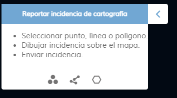

<p align="center">
  
</p>
<h1 align="center"><strong>APICNIG</strong> <small>🔌 M.plugin.InciCarto</small></h1>

<p align="center">
  <a title="MIT License" href="LICENSE">
    
  </a>
  <a title="Node version" href="https://nodejs.org/es">
    
  </a>  
  <a title="NPM version" href="https://www.npmjs.com/package/npm">
    
  </a>
  <a title="Language" href="https://www.w3schools.com/html/" target="_blank">
    
  </a>  
  <a title="Language" href="https://www.w3schools.com/js/" target="_blank">
    
  </a>
  <a title="Language" href="https://www.w3schools.com/css/" target="_blank">
    
  </a> 

  <br />
  <br />
</p>

## Descripción 👷

Plugin que permite la identificación de incidencias sobre la cartografía. El usuario puede describir el error y si lo desea categorizar el error. Despúes el error puede notificarse por correo electrónico a uno de los buzones de incidencias habilitados o darse de alta en el gestor de incidencias.

| Herramienta cerrada |Despliegue vertical|
|:----:|:----:|
|||

## Dependencias 👷

- incicarto.ol.min.js
- incicarto.ol.min.css


```html
 <link href="../../plugins/incicarto/incicarto.ol.min.css" rel="stylesheet" />
 <script type="text/javascript" src="../../plugins/incicarto/incicarto.ol.min.js"></script>
```

## Caso práctico de uso

| | |
|:----:|:----:|
||El usuario despliega la herramienta de notificación de incidencias y se sitúa en la zona donde ha encontrado el error.|
|El usuario elige entre las herramientas disponibles para señalar la incidencia; punto, línea o polígono. Se desplegará el menú de incidencias, desde donde podrá crear geometrías, editarlas y aplicarles un estilo.||
||Una vez creada la incidencia , el usuario puede modificarla en cualquier momento para redefinirla mejor o, borrarla, o incluso generar más incidencias presentes en la zona..|
|Una vez localizadas las incidencias de la zona de estudio, podemos notificar las incidencias para su corrección. Para ello pulsará en la herramienta con la campanilla.||
||En la ventana emergente podemos clasificar el error si tenemos datos o conocimientos para ello. También podemos introducir un correo electrónico para realizar un seguimiento de la incidencia y una pequeña descripción libre para documentar la incidencia.|

Disponemos de dos posibilidades para notificar la incidencia. 

* Mediante un correo electrónico dirigido al buzón de incidencias relacionado con la incidencia detectada.
* Al gestor de incidencias INCIGEO para su posterior asignación al servicio competente para su subsanación.


## Parámetros de configuración

El constructor se inicializa con un JSON de options con los siguientes atributos:

- **collapsed**: Indica si el plugin viene cerrado por defecto (true/false). Por defecto: true.
- **collapsible**: Indica si el plugin se puede cerrar (true/false). Por defecto: true.
- **position**: Indica la posición donde se mostrará el plugin.
  - 'TL': (top left) - Arriba a la izquierda (por defecto).
  - 'TR': (top right) - Arriba a la derecha.
  - 'BL': (bottom left) - Abajo a la izquierda.
  - 'BR': (bottom right) - Abajo a la derecha.
- **prefixSubject**: Prefijo que llevará el *subject* del correo electrónico enviado.
- **interfazmode**: Indica la modalidad de envío de la incidencia.
  - 'simple': se usará un cleinte de correo para enviar la incidencia.
  - 'advance': se usará el gestor de incidencias INCIGEO.
- **buzones**: Contiene un array con los objetos qued definen el nombre y direcciones de los buzones de incidencias. Cada onjeto buzón contiene dos parámetros.
  - 'name': nombre del propietario del buzón de incidencias.
  - 'email': correo electrónico del buzón.
- **controllist**: Contiene un array enumerando las listas controladas con sus características.
  - 'id': identificador de la lista.
  - 'name': nombre de la lista.
  - 'mandatory': indica si el usuario está obligado a legir una opción.
- **themeList**: Lista de control con los temas por los que podemos clasificar una incidencia. los temas son objetos con las propiedades
  - 'idTheme': identificador de código de tema.
  - 'nameTheme': nombre del tema de error.
  - 'emailTheme': correo de la entidad responsable de subsanar este error.
- **errorList**: Lista de control con las posibles categorizaciones del error.
- **productList**: Lista de control con los productos del IGN en los que se ha detectado el error.

# Parámetros API REST

```javascript
URL_API?incicarto=position*collapsed*collapsible
````
Ejemplo:

```javascript
https://componentes.cnig.es/api-core/?incicarto=BL*true*true
```

## Ejemplo

```javascript
const mp = new M.plugin.Incicarto({
  collapsed: false,
  collapsible: true,
  position: 'TL',
  interfazmode:'both', //simple, advance, both
  buzones: [{
    name: 'Cartografía (MTN, BTN, RT, HY, Pob, BCN, Prvinciales, escalas pequeñas)',
    email: 'cartografia.ign@mitma.es',
  },
  {
    name: 'Atlas Nacional de España',
    email: 'ane@mitma.es',
  },
  {...},
  ],
  controllist:[
    {
      id: 'themeList',
      name:'Temas de errores',
      mandatory: true,
    },
    {
      id: 'errorList',
      name:'Tipos de errores',
      mandatory: true,
    },
    {
      id: 'productList',
      name:'Lista de productos',
      mandatory: true,
    }
  ],
  themeList: [
    {
      idTheme: 1,
      nameTheme: 'No especificado',
      emailTheme: 'consultas@cnig.es',
    },
    {
      idTheme: 2,
      nameTheme: 'Relieve',
      emailTheme: 'cartografia.ign@mitma.es',
    },
  ],
  errorList: [
    'No especificado',
    'Omisión',
    'Comisión',
    '...',
  ],
  productList: [
    'No especificado',
    'Serie MTN25',
    'Serie MTN50',
    '...',
  ],
});
```

---

## 👨‍💻 Desarrollo

Para el stack de desarrollo de este componente se ha utilizado

* NodeJS Version: 14.16
* NPM Version: 6.14.11
* Entorno Windows.

## 📐 Para configurar el stack de desarrollo

### 1️⃣ Instalación de dependencias / *Install Dependencies*

```bash
npm i
```

### 2️⃣ Arranque del servidor de desarrollo / *Run Application*

```bash
npm run start
```

## 📂 Estructura del código / *Code scaffolding*

```any
/
├── assets 🌈               # Recursos
├── src 📦                  # Código fuente.
├── task 📁                 # EndPoints
├── test 📁                 # Testing
├── tmp 📁                  # Destination directory for images.
├── webpack-config 📁       # Webpack configs.
└── ...
```
## 📌 Metodologías y pautas de desarrollo / *Methodologies and Guidelines*

Metodologías y herramientas usadas en el proyecto para garantizar el Quality Assurance Code (QAC)

* ESLint
  * [NPM ESLint](https://www.npmjs.com/package/eslint) \
  * [NPM ESLint | Airbnb](https://www.npmjs.com/package/eslint-config-airbnb)

## ⛽️ Revisión e instalación de dependencias / *Review and Update Dependencies*

Para la revisión y actualización de las dependencias de los paquetes npm es necesario instalar de manera global el paquete/ módulo "npm-check-updates".

```bash
# Install and Run
$npm i -g npm-check-updates
$ncu
```

## 🚔 Licencia

* [European Union Public Licence v1.2](https://raw.githubusercontent.com/JoseJPR/tutorial-nodejs-cli-system-notification/main/README.md)

https://cursoapicnig.vercel.app/PGxpbmsgcmVsPSJzdHlsZXNoZWV0IiB0eXBlPSJ0ZXh0L2NzcyIgaHJlZj0iLy9mb250cy5nb29nbGVhcGlzLmNvbS9jc3M/ZmFtaWx5PU11bGkiIC8+DQoNCjxoMj5zdWJqZWN0PC9oMj4NCg0KPGRpdiBjbGFzcz0ibWFpbi1mb3JtIj4NCiAgICA8ZGl2IGNsYXNzPSJmb3JtLWl0ZW0iPg0KICAgICAgICA8bGFiZWwgZm9yPSJkZXN0aW5hdGFyeSI+RGVzdGluYXRhcmlvIGRlIGxhIGluY2lkZW5jaWE8L2xhYmVsPg0KICAgICAgICA8aW5wdXQgaWQ9ImRlc3RpbmF0YXJ5IiB0eXBlPSJ0ZXh0IiBuYW1lPSJkZXN0aW5hdGFyeSIgcGxhY2Vob2xkZXI9ImRlc3RpbmF0YXJ5Ij48L2lucHV0Pg0KICAgIDwvZGl2Pg0KICAgIDxkaXYgY2xhc3M9ImZvcm0taXRlbSI+DQogICAgICAgIDxsYWJlbCBmb3I9InNlbmRlcm5hbWUiPlJlbWl0ZW50ZSBpbmNpZGVuY2lhPC9sYWJlbD4NCiAgICAgICAgPGlucHV0IGlkPSJzZW5kZXJuYW1lIiB0eXBlPSJ0ZXh0IiBuYW1lPSJzZW5kZXJuYW1lIiBwbGFjZWhvbGRlcj0ic2VuZGVybmFtZSI+PC9pbnB1dD4NCiAgICA8L2Rpdj4NCiAgICA8ZGl2IGNsYXNzPSJmb3JtLWl0ZW0iPg0KICAgICAgICA8bGFiZWwgZm9yPSJzZW5kZXJlbWFpbCI+RW1haWwgcmVtaXRlbnRlIGluY2lkZW5jaWE8L2xhYmVsPg0KICAgICAgICA8aW5wdXQgaWQ9InNlbmRlcmVtYWlsIiB0eXBlPSJ0ZXh0IiBuYW1lPSJzZW5kZXJlbWFpbCIgcGxhY2Vob2xkZXI9InNlbmRlcmVtYWlsIj48L2lucHV0Pg0KICAgIDwvZGl2Pg0KICAgIDxkaXYgY2xhc3M9ImZvcm0taXRlbSI+DQogICAgICAgIDxsYWJlbCBmb3I9ImVyckRlc2NyaXB0aW9uIj5EZXNjcmlwY2nDs24gZGUgbGEgaW5jaWRlbmNpYTwvbGFiZWw+DQogICAgICAgIDx0ZXh0YXJlYSBpZD0iZXJyRGVzY3JpcHRpb24iIHR5cGU9InRleHQiIG5hbWU9ImVyckRlc2NyaXB0aW9uIiBwbGFjZWhvbGRlcj0iZXJyRGVzY3JpcHRpb24iPjwvdGV4dGFyZWE+DQogICAgPC9kaXY+DQogICAgPGRpdiBjbGFzcz0iZm9ybS1pdGVtIj4NCiAgICAgICAgPGxhYmVsIGZvcj0ic2VuZGVyZ2VvbWV0cnkiPkdlb21ldHLDrWEgKGdlb0pTT04pPC9sYWJlbD4NCiAgICAgICAgPHRleHRhcmVhIGlkPSJzZW5kZXJnZW9tZXRyeSIgdHlwZT0idGV4dCIgbmFtZT0ic2VuZGVyZ2VvbWV0cnkiIHBsYWNlaG9sZGVyPSJzZW5kZXJnZW9tZXRyeSI+PC90ZXh0YXJlYT4NCiAgICA8L2Rpdj4NCiAgICA8ZGl2IGNsYXNzPSJmb3JtLWl0ZW0iPg0KICAgICAgICA8bGFiZWwgZm9yPSJzaGFyZVVSTCI+VVJMIGRlIGxhIEFwcDwvbGFiZWw+DQogICAgICAgIDxpbnB1dCBpZD0ic2hhcmVVUkwiIHR5cGU9InRleHQiIG5hbWU9InNoYXJlVVJMIiBwbGFjZWhvbGRlcj0ic2hhcmVVUkwiPjwvaW5wdXQ+DQogICAgPC9kaXY+DQo8L2Rpdj4=%7CYm9keSB7IA0KICAgIGZvbnQtZmFtaWx5OiBNdWxpOyANCiAgICBmb250LXNpemU6IDE2cHg7IA0KICAgIGZvbnQtc3R5bGU6IG5vcm1hbDsgDQogICAgZm9udC12YXJpYW50OiBub3JtYWw7IA0KICAgIGZvbnQtd2VpZ2h0OiA3MDA7IA0KfSANCg0KDQpoMiB7IA0KICAgIGZvbnQtZmFtaWx5OiBNdWxpOyANCiAgICBmb250LXNpemU6IDI0cHg7IA0KICAgIGZvbnQtc3R5bGU6IG5vcm1hbDsgDQogICAgZm9udC12YXJpYW50OiBub3JtYWw7IA0KICAgIGZvbnQtd2VpZ2h0OiA3MDA7IA0KICAgIGxpbmUtaGVpZ2h0OiAyNi40cHg7DQp9IA0KDQoubWFpbi1mb3JtIHsNCiAgICBkaXNwbGF5OiBmbGV4Ow0KICAgIG1hcmdpbi10b3A6IDE1cHg7DQogICAgd2lkdGg6IDEwMCU7DQogICAganVzdGlmeS1jb250ZW50OiBjZW50ZXI7DQogICAgYWxpZ24tY29udGVudDogY2VudGVyOw0KICAgIGZsZXgtZGlyZWN0aW9uOiBjb2x1bW47DQogICAgZmxleC1ncm93OiAyOw0KICAgIGZvbnQtc2l6ZTogMTVweDsNCiAgICBhbGlnbi1pdGVtczogY2VudGVyOw0KfQ0KDQouZm9ybS1pdGVtIHsNCiAgICBkaXNwbGF5OiBmbGV4Ow0KICAgIGZsZXgtZGlyZWN0aW9uOiBjb2x1bW47DQogICAgd2lkdGg6IDc1JTsNCiAgICBtYXJnaW4tdG9wOiAxMHB4Ow0KfQ0KDQouZm9ybS1pdGVtIGlucHV0W3R5cGU9dGV4dF0gew0KICAgIG1hcmdpbjogNXB4Ow0KICAgIHBhZGRpbmc6IDVweDsNCiAgICBiYWNrZ3JvdW5kLWNvbG9yOiB0cmFuc3BhcmVudDsNCiAgICBjdXJzb3I6IGF1dG87DQogICAgYm9yZGVyLXJhZGl1czogNHB4Ow0KICAgIGJvcmRlcjogMXB4IHNvbGlkIHJnYmEoMCwwLDAsLjUpOw0KICAgIC13ZWJraXQtYXBwZWFyYW5jZTogbm9uZTsNCiAgICAtbW96LWFwcGVhcmFuY2U6IG5vbmU7DQogICAgYXBwZWFyYW5jZTogbm9uZTsNCiAgICBjb2xvcjogIzZjNmM2YzsNCiAgICBmb250LXNpemU6IDEzcHg7DQp9DQoNCi5mb3JtLWl0ZW0gdGV4dGFyZWEgew0KICAgIG1hcmdpbjogNXB4Ow0KICAgIHBhZGRpbmc6IDVweDsgICAgDQogICAgZGlzcGxheTogYmxvY2s7DQogICAgYm9yZGVyLXJhZGl1czogNHB4Ow0KICAgIGJvcmRlcjogMXB4IHNvbGlkIHJnYmEoMCwwLDAsLjUpOw0KICAgIGNvbG9yOiAjNmM2YzZjOw0KICAgIHJlc2l6ZTogbm9uZTsNCiAgICBoZWlnaHQ6IDRlbTsNCn0=%7C

