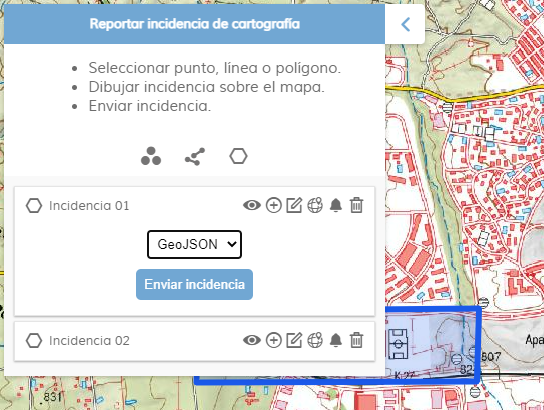

<p align="center">
  
</p>
<h1 align="center"><strong>APICNIG</strong> <small>🔌 M.plugin.InciCarto</small></h1>

<p align="center">
  <a title="MIT License" href="LICENSE.md">
    
  </a>
  <a title="Node version" href="#">
    
  </a>  
  <a title="NPM version" href="#">
    
  </a>
  <a title="Language" href="https://www.w3schools.com/html/" target="_blank">
    
  </a>  
  <a title="Language" href="https://www.w3schools.com/js/" target="_blank">
    
  </a>
  <a title="Language" href="https://www.w3schools.com/css/" target="_blank">
    
  </a> 

  <br />
  <br />
</p>

## Descripción 👷

Plugin que permite la identificación de incidencias sobre la cartografía. El usuario puede describir el error y si lo desea categorizar el error. Despúes el error puede notificarse por correo electrónico a uno de los buzones de incidencias habilitados o darse de alta en el gestor de incidencias.

| Herramienta cerrada |Despliegue vertical|
|:----:|:----:|
|||

## Dependencias 👷

- incicarto.ol.min.js
- incicarto.ol.min.css


```html
 <link href="../../plugins/incicarto/incicarto.ol.min.css" rel="stylesheet" />
 <script type="text/javascript" src="../../plugins/incicarto/incicarto.ol.min.js"></script>
```

## Caso práctico de uso

| | |
|:----:|:----:|
||El usuario despliega la herramienta de notificación de incidencias y se sitúa en la zona donde ha encontrado el error.|
|El usuario elige entre las herramientas disponibles para señalar la incidencia; punto, línea o polígono. Se desplegará el menú de incidencias, desde donde podrá crear geometrías, editarlas y aplicarles un estilo.||
||Una vez creada la incidencia , el usuario puede modificarla en cualquier momento para redefinirla mejor o, borrarla, o incluso generar más incidencias presentes en la zona..|
|Una vez localizadas las incidencias de la zona de estudio, podemos notificar las incidencias para su corrección. Para ello pulsará en la herramienta con la campanilla.||
||Seleccionamos el formato en el que se enviará la incidencia. En este momento sólo está habilitado geoJSON, pero las posibilidades se ampliarán a KML o GPX. Seguidamente pulsamoel botón de enviar incidencia.|
|En la ventana emergente podemos clasificar el error si tenemos datos o conocimientos para ello. También podemos introducir un correo electrónico para realizar un seguimiento de la incidencia y una pequeña descripción libre para documentar la incidencia.||

Disponemos de dos posibilidades para notificar la incidencia. 

* Mediante un correo electrónico dirigido al buzón de incidencias relacionado con la incidencia detectada.
* Al gestor de incidencias INCIGEO para su posterior asignación al servicio competente para su subsanación.


## Parámetros de configuración

El constructor se inicializa con un JSON de options con los siguientes atributos:

- **collapsed**. Indica si el plugin viene cerrado por defecto (true/false).
- **collapsible**. Indica si el plugin se puede cerrar (true/false).
- **position**. Indica la posición donde se mostrará el plugin
  - 'TL':top left (default)
  - 'TR':top right
  - 'BL':bottom left
  - 'BR':bottom right
- **buzones**. Contiene un array con los objetos qued definen el nombre y direcciones de los buzones de incidencias. Cada onjeto buzón contiene dos parámetros.
  - 'name': nombre del propietario del buzón de incidencias.
  - 'email': correo electrónico del buzón.
- **controllist**. Contiene un array enumerando las listas controladas con sus características.
  - 'id': identificador de la lista.
  - 'name': nombre de la lista.
  - 'mandatory': indica si el usuario está obligado a legir una opción.
- **themeList**. Lista de control con los temas por los que podemos clasificar una incidencia.
- **errorList**. Lista de control con las posibles categorizaciones del error.
- **productList**. Lista de control con los productos del IGN en los que se ha detectado el error.

# Parámetros API REST

```javascript
URL_API?incicarto=position*collapsed*collapsible
````
Ejemplo:

```javascript
http://mapea-lite.desarrollo.guadaltel.es/api-core/?incicarto=BL*true*true
```

## Ejemplo

```javascript
const mp = new M.plugin.Incicarto({
  collapsed: false,
  collapsible: true,
  position: 'TL',
  buzones: [{
    name: 'Cartografía (MTN, BTN, RT, HY, Pob, BCN, Prvinciales, escalas pequeñas)',
    email: 'cartografia.ign@mitma.es',
  },
  {
    name: 'Atlas Nacional de España',
    email: 'ane@mitma.es',
  },
  {...},
  ],
  controllist:[
    {
      id: 'themeList',
      name:'Temas de errores',
      mandatory: true,
    },
    {
      id: 'errorList',
      name:'Tipos de errores',
      mandatory: true,
    },
    {
      id: 'productList',
      name:'Lista de productos',
      mandatory: true,
    }
  ],
  themeList: [
    'No especificado',
    'Relieve',
    'Hidrografía',
    '...',
  ],
  errorList: [
    'No especificado',
    'Omisión',
    'Comisión',
    '...',
  ],
  productList: [
    'No especificado',
    'Serie MTN25',
    'Serie MTN50',
    '...',
  ],
});
```

---

## 👨‍💻 Desarrollo

Para el stack de desarrollo de este componente se ha utilizado

* NodeJS Version: 14.16
* NPM Version: 6.14.11

## 📐 Para configurar el stack de desarrollo

### 1️⃣ Instalación de dependencias / *Install Dependencies*

```bash
npm i
```

### 2️⃣ Arranque del servidor de desarrollo / *Run Application*

```bash
npm run start
```

## 📂 Estructura del código / *Code scaffolding*

```any
/
├── assets 🌈               # Recursos
├── src 📦                  # Código fuente.
├── task 📁                 # EndPoints
├── test 📁                 # Testing
├── tmp 📁                  # Destination directory for images.
├── webpack-config 📁       # Webpack configs.
└── ...
```
## 📌 Metodologías y pautas de desarrollo / *Methodologies and Guidelines*

Metodologías y herramientas usadas en el proyecto para garantizar el Quality Assurance Code (QAC)

* ESLint
  * [NPM ESLint](https://www.npmjs.com/package/eslint) \
  * [NPM ESLint | Airbnb](https://www.npmjs.com/package/eslint-config-airbnb)

## ⛽️ Revisión e instalación de dependencias / *Review and Update Dependencies*

Para la revisión y actualización de las dependencias de los paquetes npm es necesario instalar de manera global el paquete/ módulo "npm-check-updates".

```bash
# Install and Run
$npm i -g npm-check-updates
$ncu
```

## 🚔 Licencia

* [European Union Public Licence v1.2](https://raw.githubusercontent.com/JoseJPR/tutorial-nodejs-cli-system-notification/main/README.md)