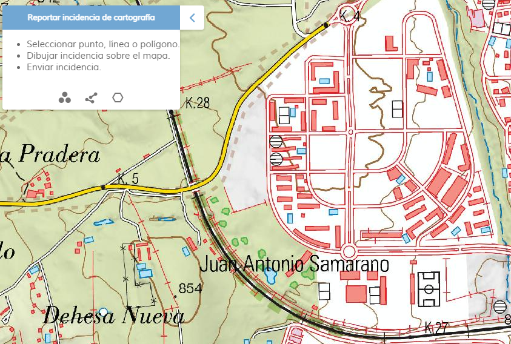
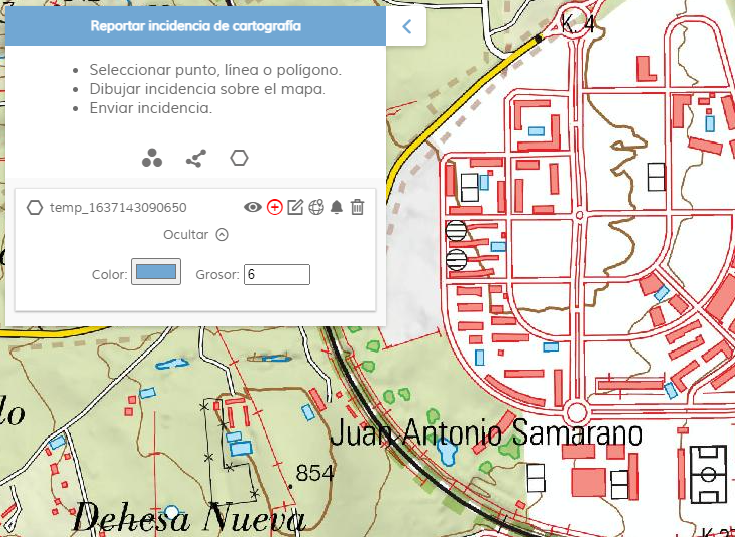
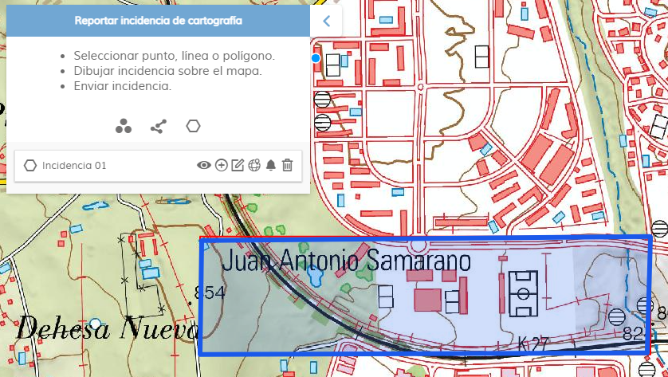
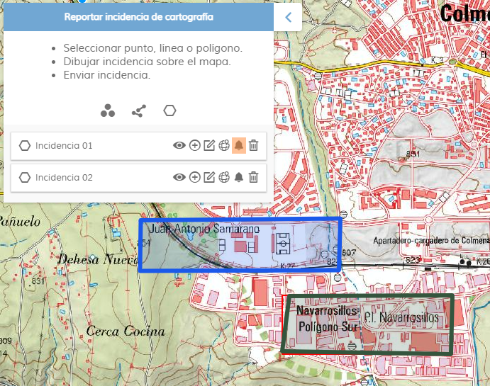
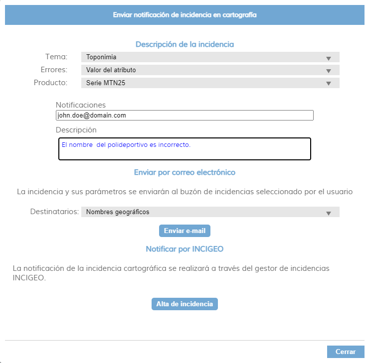

<p align="center">
  
</p>
<h1 align="center"><strong>APICNIG</strong> <small>🔌 M.plugin.InciCarto</small></h1>

# Descripción

Plugin que permite la identificación de incidencias sobre la cartografía. El usuario puede describir el error y si lo desea categorizar el error. Despúes el error puede notificarse por correo electrónico a uno de los buzones de incidencias habilitados o darse de alta en el gestor de incidencias.


# Dependencias

Para que el plugin funcione correctamente es necesario importar las siguientes dependencias en el documento html:

- **incicarto.ol.min.js**
- **incicarto.ol.min.css**


```html
 <link href="https://componentes.cnig.es/api-core/plugins/incicarto/incicarto.ol.min.css" rel="stylesheet" />
 <script type="text/javascript" src="https://componentes.cnig.es/api-core/plugins/incicarto/incicarto.ol.min.js"></script>
```

# Uso del histórico de versiones

Existe un histórico de versiones de todos los plugins de API-CNIG en [api-ign-legacy](https://github.com/IGN-CNIG/API-CNIG/tree/master/api-ign-legacy/plugins) para hacer uso de versiones anteriores.
Ejemplo:
```html
 <link href="https://componentes.cnig.es/api-core/plugins/incicarto/incicarto-1.0.0.ol.min.css" rel="stylesheet" />
 <script type="text/javascript" src="https://componentes.cnig.es/api-core/plugins/incicarto/incicarto-1.0.0.ol.min.js"></script>
```

# Caso práctico de uso

| | |
|:----:|:----:|
||El usuario despliega la herramienta de notificación de incidencias y se sitúa en la zona donde ha encontrado el error.|
|El usuario elige entre las herramientas disponibles para señalar la incidencia; punto, línea o polígono. Se desplegará el menú de incidencias, desde donde podrá crear geometrías, editarlas y aplicarles un estilo.||
||Una vez creada la incidencia , el usuario puede modificarla en cualquier momento para redefinirla mejor o, borrarla, o incluso generar más incidencias presentes en la zona..|
|Una vez localizadas las incidencias de la zona de estudio, podemos notificar las incidencias para su corrección. Para ello pulsará en la herramienta con la campanilla.||
||En la ventana emergente podemos clasificar el error si tenemos datos o conocimientos para ello. También podemos introducir un correo electrónico para realizar un seguimiento de la incidencia y una pequeña descripción libre para documentar la incidencia.|

Disponemos de dos posibilidades para notificar la incidencia.

* Mediante un correo electrónico dirigido al buzón de incidencias relacionado con la incidencia detectada.
* Al gestor de incidencias INCIGEO para su posterior asignación al servicio competente para su subsanación.


# Parámetros

El constructor se inicializa con un JSON con los siguientes atributos:

- **position**: Indica la posición donde se mostrará el plugin.
  - 'TL': (top left) - Arriba a la izquierda.
  - 'TR': (top right) - Arriba a la derecha (por defecto).
  - 'BL': (bottom left) - Abajo a la izquierda.
  - 'BR': (bottom right) - Abajo a la derecha.
- **collapsed**: Indica si el plugin viene colapsado de entrada (true/false). Por defecto: true.
- **collapsible**: Indica si el plugin puede abrirse y cerrarse (true) o si permanece siempre abierto (false). Por defecto: true.
- **tooltip**: Información emergente para mostrar en el tooltip del plugin (se muestra al dejar el ratón encima del plugin como información). Por defecto: Notificar incidencia en cartografía.
- **wfszoom**: Valor del zoom. Por defecto: 12.
- **prefixSubject**: Prefijo que llevará el *subject* del correo electrónico enviado. Por defecto: 'Incidencia cartografía - '.
- **interfazmode**: Indica la modalidad de envío de la incidencia. Por defecto: simple.
  - 'simple': se usará un cleinte de correo para enviar la incidencia.
  - 'advance': se usará el gestor de incidencias INCIGEO.
- **buzones**: Contiene un array con los objetos que definen el nombre y direcciones de los buzones de incidencias. Cada objeto buzón contiene dos parámetros. Por defecto: [].
  - 'name': nombre del propietario del buzón de incidencias.
  - 'email': correo electrónico del buzón.
- **controllist**: Contiene un array enumerando las listas controladas con sus características.
  - 'id': identificador de la lista.
  - 'name': nombre de la lista.
  - 'mandatory': indica si el usuario está obligado a legir una opción.

Por defecto:
```javascript
[
  {
    id: 'themeList',
    name: 'Temas de errores',
    mandatory: true,
  },
  {
    id: 'errorList',
    name: 'Tipos de errores',
    mandatory: true,
  },
  {
    id: 'productList',
    name: 'Lista de productos',
    mandatory: true,
  },
]
```

- **themeList**: Lista de control con los temas por los que podemos clasificar una incidencia. los temas son objetos con las propiedades. Por defecto: [].
  - 'idTheme': identificador de código de tema.
  - 'nameTheme': nombre del tema de error.
  - 'emailTheme': correo de la entidad responsable de subsanar este error.
- **errorList**: Lista de control con las posibles categorizaciones del error. Por defecto: [].
- **productList**: Lista de control con los productos del IGN en los que se ha detectado el error. Por defecto: [].
- **isDraggable**: Permite mover el plugin por el mapa. Por defecto: false.

# API-REST

```javascript
URL_API?incicarto=position*collapsed*collapsible*tooltip*wfszoom*prefixSubject*interfazmode*isDraggable
```

<table>
  <tr>
    <td>Parámetros</td>
    <td>Opciones/Descripción</td>
    <td>Disponibilidad</td>
  </tr>
   <tr>
    <td>position</td>
    <td>TR/TL/BR/BL</td>
    <td>Base64 ✔️ | Separador ✔️</td>
  </tr>
   <tr>
    <td>collapsed</td>
    <td>true/false</td>
    <td>Base64 ✔️ | Separador ✔️</td>
  </tr>
   <tr>
    <td>collapsible</td>
    <td>true/false</td>
    <td>Base64 ✔️ | Separador ✔️</td>
  </tr>
  <tr>
    <td>tooltip</td>
    <td>Valor a usar para mostrar en el tooltip del plugin</td>
    <td>Base64 ✔️ | Separador ✔️</td>
  </tr>
  <tr>
    <td>wfszoom</td>
    <td>Valor del zoom</td>
    <td>Base64 ✔️ | Separador ✔️</td>
  </tr>
  <tr>
    <td>prefixSubject</td>
    <td>Prefijo que llevará el *subject* del correo electrónico</td>
    <td>Base64 ✔️ | Separador ✔️</td>
  </tr>
  <tr>
    <td>interfazmode</td>
    <td>simple/advance</td>
    <td>Base64 ✔️ | Separador ✔️</td>
  </tr>
  <tr>
    <td>buzones</td>
    <td>array con los objetos que definen el nombre y direcciones de los buzones de incidencias</td>
    <td>Base64 ✔️ | Separador ❌</td>
  </tr>
  <tr>
    <td>controllist</td>
    <td>array enumerando las listas controladas con sus características (id, name, mandatory)</td>
    <td>Base64 ✔️ | Separador ❌</td>
  </tr>
  <tr>
    <td>themeList</td>
    <td>Lista de control con temas por los que podemos clasificar una incidencia (idTheme, nameTheme, emailTheme)</td>
    <td>Base64 ✔️ | Separador ❌</td>
  </tr>
  <tr>
    <td>errorList</td>
    <td>Lista de control con las posibles categorizaciones del error.</td>
    <td>Base64 ✔️ | Separador ❌</td>
  </tr>
  <tr>
    <td>productList</td>
    <td>Lista de control con los productos del IGN en los que se ha detectado el error.</td>
    <td>Base64 ✔️ | Separador ❌</td>
  </tr>
  <tr>
    <td>isDraggable</td>
    <td>true/false</td>
    <td>Base64 ✔️ | Separador ✔️</td>
  </tr>
</table>


### Ejemplos de uso API-REST
```
https://componentes.cnig.es/api-core?incicarto=TL*true*true*Incicarto%20plugin
```

```
https://componentes.cnig.es/api-core?incicarto=TL*true*true*Incicarto%20plugin*12*Incidencia%20cartográfica%20-%20*simple
```

### Ejemplo de uso API-REST en base64

Para la codificación en base64 del objeto con los parámetros del plugin podemos hacer uso de la utilidad M.utils.encodeBase64.
Ejemplo:
```javascript
M.utils.encodeBase64(obj_params);
```

Ejemplo del constructor:
```javascript
{
  collapsed: true,
  collapsible: true,
  position: "TL",
  wfszoom: 12,
  prefixSubject: "Incidencia cartogrfica - ",
  interfazmode: "simple",
  buzones: [
    {
      name: "Cartografa (MTN, BTN, RT, HY, Pob, BCN, Provinciales, escalas pequeas)",
      email: "cartografia.ign@mitma.es",
    },
    {
      name: "Atlas Nacional de Espaa",
      email: "ane@mitma.es",
    },
  ],
  controllist: [
    {
      id: "themeList",
      name: "Temas de errores",
      mandatory: true,
    },
    {
      id: "errorList",
      name: "Tipos de errores",
      mandatory: true,
    },
    {
      id: "productList",
      name: "Lista de productos",
      mandatory: true,
    },
  ],
  themeList: [
    {
      idTheme: 1,
      nameTheme: "No especificado",
      emailTheme: "consultas@cnig.es",
    },
    {
      idTheme: 2,
      nameTheme: "Relieve",
      emailTheme: "cartografia.ign@mitma.es",
    },
  ],
  errorList: [
    "No especificado",
    "Omisin",
    "Comisin",
    "Clasificacin",
    "Nombre",
    "Valor del atributo",
    "Forma",
    "Localizacin",
    "Otros",
  ],
  productList: [
    "No especificado",
    "Serie MTN25",
    "Serie MTN50",
    "BTN25",
    "BTN100",
    "MP200",
    "BCN200",
    "BCN500",
    "Mapa Autonmico",
    "Mapa Espaa 1:500 000",
    "Mapa Espaa 1:1 000 000",
    "Cartociudad",
    "Redes de Transporte",
    "Hidrografa",
    "Poblaciones",
    "Mundo real",
    "IGN Base",
    "Otros productos",
  ],
}
```

```
https://componentes.cnig.es/api-core?incicarto=base64=eyJjb2xsYXBzZWQiOnRydWUsImNvbGxhcHNpYmxlIjp0cnVlLCJwb3NpdGlvbiI6IlRMIiwid2Zzem9vbSI6MTIsInByZWZpeFN1YmplY3QiOiJJbmNpZGVuY2lhIGNhcnRvZ3JmaWNhIC0gIiwiaW50ZXJmYXptb2RlIjoic2ltcGxlIiwiYnV6b25lcyI6W3sibmFtZSI6IkNhcnRvZ3JhZmEgKE1UTiwgQlROLCBSVCwgSFksIFBvYiwgQkNOLCBQcm92aW5jaWFsZXMsIGVzY2FsYXMgcGVxdWVhcykiLCJlbWFpbCI6ImNhcnRvZ3JhZmlhLmlnbkBtaXRtYS5lcyJ9LHsibmFtZSI6IkF0bGFzIE5hY2lvbmFsIGRlIEVzcGFhIiwiZW1haWwiOiJhbmVAbWl0bWEuZXMifV0sImNvbnRyb2xsaXN0IjpbeyJpZCI6InRoZW1lTGlzdCIsIm5hbWUiOiJUZW1hcyBkZSBlcnJvcmVzIiwibWFuZGF0b3J5Ijp0cnVlfSx7ImlkIjoiZXJyb3JMaXN0IiwibmFtZSI6IlRpcG9zIGRlIGVycm9yZXMiLCJtYW5kYXRvcnkiOnRydWV9LHsiaWQiOiJwcm9kdWN0TGlzdCIsIm5hbWUiOiJMaXN0YSBkZSBwcm9kdWN0b3MiLCJtYW5kYXRvcnkiOnRydWV9XSwidGhlbWVMaXN0IjpbeyJpZFRoZW1lIjoxLCJuYW1lVGhlbWUiOiJObyBlc3BlY2lmaWNhZG8iLCJlbWFpbFRoZW1lIjoiY29uc3VsdGFzQGNuaWcuZXMifSx7ImlkVGhlbWUiOjIsIm5hbWVUaGVtZSI6IlJlbGlldmUiLCJlbWFpbFRoZW1lIjoiY2FydG9ncmFmaWEuaWduQG1pdG1hLmVzIn1dLCJlcnJvckxpc3QiOlsiTm8gZXNwZWNpZmljYWRvIiwiT21pc2luIiwiQ29taXNpbiIsIkNsYXNpZmljYWNpbiIsIk5vbWJyZSIsIlZhbG9yIGRlbCBhdHJpYnV0byIsIkZvcm1hIiwiTG9jYWxpemFjaW4iLCJPdHJvcyJdLCJwcm9kdWN0TGlzdCI6WyJObyBlc3BlY2lmaWNhZG8iLCJTZXJpZSBNVE4yNSIsIlNlcmllIE1UTjUwIiwiQlROMjUiLCJCVE4xMDAiLCJNUDIwMCIsIkJDTjIwMCIsIkJDTjUwMCIsIk1hcGEgQXV0b25taWNvIiwiTWFwYSBFc3BhYSAxOjUwMCAwMDAiLCJNYXBhIEVzcGFhIDE6MSAwMDAgMDAwIiwiQ2FydG9jaXVkYWQiLCJSZWRlcyBkZSBUcmFuc3BvcnRlIiwiSGlkcm9ncmFmYSIsIlBvYmxhY2lvbmVzIiwiTXVuZG8gcmVhbCIsIklHTiBCYXNlIiwiT3Ryb3MgcHJvZHVjdG9zIl19
```

# Ejemplo de uso

```javascript
const mp = new M.plugin.Incicarto({
  collapsed: false,
  collapsible: true,
  position: 'TL',
  interfazmode:'both', //simple, advance, both
  buzones: [{
    name: 'Cartografía (MTN, BTN, RT, HY, Pob, BCN, Prvinciales, escalas pequeñas)',
    email: 'cartografia.ign@mitma.es',
  },
  {
    name: 'Atlas Nacional de España',
    email: 'ane@mitma.es',
  },
  {...},
  ],
  controllist:[
    {
      id: 'themeList',
      name:'Temas de errores',
      mandatory: true,
    },
    {
      id: 'errorList',
      name:'Tipos de errores',
      mandatory: true,
    },
    {
      id: 'productList',
      name:'Lista de productos',
      mandatory: true,
    }
  ],
  themeList: [
    {
      idTheme: 1,
      nameTheme: 'No especificado',
      emailTheme: 'consultas@cnig.es',
    },
    {
      idTheme: 2,
      nameTheme: 'Relieve',
      emailTheme: 'cartografia.ign@mitma.es',
    },
  ],
  errorList: [
    'No especificado',
    'Omisión',
    'Comisión',
    '...',
  ],
  productList: [
    'No especificado',
    'Serie MTN25',
    'Serie MTN50',
    '...',
  ],
});
```

# 👨‍💻 Desarrollo

Para el stack de desarrollo de este componente se ha utilizado

* NodeJS Version: 14.16
* NPM Version: 6.14.11
* Entorno Windows.

## 📐 Configuración del stack de desarrollo / *Work setup*


### 🐑 Clonar el repositorio / *Cloning repository*

Para descargar el repositorio en otro equipo lo clonamos:

```bash
git clone [URL del repositorio]
```

### 1️⃣ Instalación de dependencias / *Install Dependencies*

```bash
npm i
```

### 2️⃣ Arranque del servidor de desarrollo / *Run Application*

```bash
npm run start
```

## 📂 Estructura del código / *Code scaffolding*

```any
/
├── src 📦                  # Código fuente
├── task 📁                 # EndPoints
├── test 📁                 # Testing
├── webpack-config 📁       # Webpack configs
└── ...
```
## 📌 Metodologías y pautas de desarrollo / *Methodologies and Guidelines*

Metodologías y herramientas usadas en el proyecto para garantizar el Quality Assurance Code (QAC)

* ESLint
  * [NPM ESLint](https://www.npmjs.com/package/eslint) \
  * [NPM ESLint | Airbnb](https://www.npmjs.com/package/eslint-config-airbnb)

## ⛽️ Revisión e instalación de dependencias / *Review and Update Dependencies*

Para la revisión y actualización de las dependencias de los paquetes npm es necesario instalar de manera global el paquete/ módulo "npm-check-updates".

```bash
# Install and Run
$npm i -g npm-check-updates
$ncu
```
