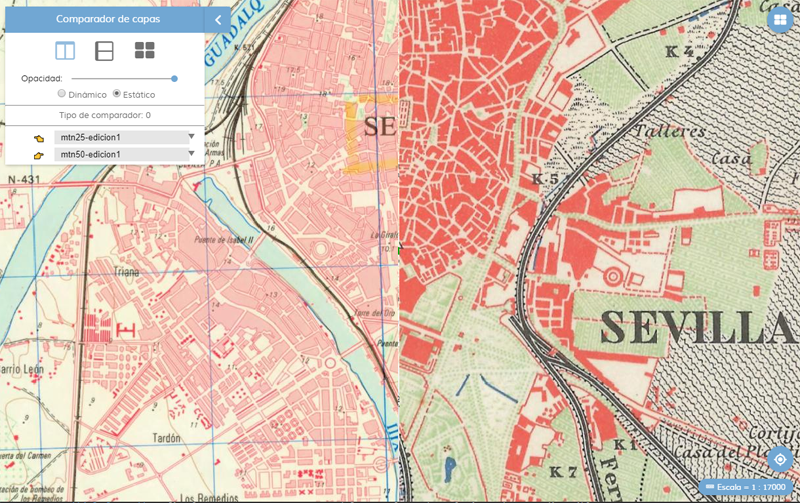
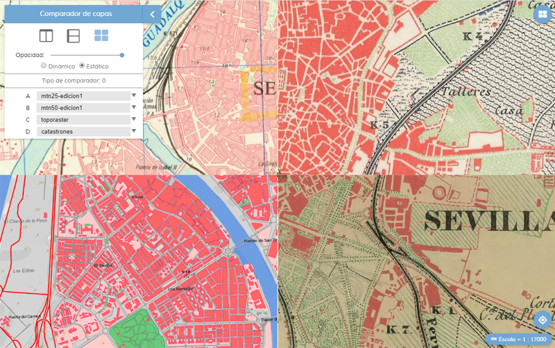

# M.plugin.LyrCompare

Plugin que permite comparar varias capas sobre una cartografía base. La extensión de las capas sobre lienzo vienen definidas por la posición del ratón o por el punto medio del lienzo.




# Dependencias

- lyrcompare.ol.min.js
- lyrcompare.ol.min.css


```html
 <link href="../../plugins/lyrcompare/lyrcompare.ol.min.css" rel="stylesheet" />
 <script type="text/javascript" src="../../plugins/lyrcompare/lyrcompare.ol.min.js"></script>
```

# Parámetros

- El constructor se inicializa con un JSON de options con los siguientes atributos:

- **layer**. Parámetro obligatorio. Array que puede contener el/los nombre/s de la/s capa/s (que está/n en el mapa),
la/s url en formato mapea para insertar una capa a través de servicios WMS ó WMTS, o la capa como objeto.
A esta/s capa/s se le aplicará el efecto de transparencia.

- **position**. Indica la posición donde se mostrará el plugin.
  - 'TL':top left
  - 'TR':top right (default)
  - 'BL':bottom left
  - 'BR':bottom right

- **collapsible**. Si es *true*, el botón aparece, y puede desplegarse y contraerse. Si es *false*, el botón no aparece. Por defecto tiene el valor *true*.

- **collapsed**. Si es *true*, el panel aparece cerrado. Si es *false*, el panel aparece abierto. Por defecto tiene el valor *true*.

- **staticDivision**. Permite definir si al arrancar la herramienta dividirá las capas por la posición del ratón *(valor 0)*, por el punto medio del lienzo de cartografía *(valor 1)* o por el punto medio del lienzo de cartografía con líneas arrastrables *(valor 2)*.

- **opacityVal**. Define el valor de la opacidad que se aplicará a las capas que se muestran sobre la cartografía base. Rango 0 a 100.

- **comparisonMode**. Define el tipo de comparación con la que arranca. Rango 0,3.
  - 0: arranca con el modo de comparación apagado.
  - 1: arranca con el modo de comparación cortina vertical.
  - 2: arranca con el modo de comparación de cortina horizontal.
  - 3: arranca con el modo de comparación múltiple de cuatro capas.

- **defaultLyrA**. Define la capa uno que se carga por defecto. Valores de 1 al número de capas disponibles.

- **defaultLyrB**. Define la capa uno que se carga por defecto. Valores de 2 al número de capas disponibles.

- **defaultLyrC**. Define la capa uno que se carga por defecto. Valores de 3 al número de capas disponibles.

- **defaultLyrD**. Define la capa uno que se carga por defecto. Valores de 4 al número de capas disponibles.

- **interface**. Define si mostrar o no la interfaz del plugin.

# Eventos

# Multi idioma

Actualmente está disponible español e inglés.

```javascript
M.language.setLang('es');//Idioma español
M.language.setLang('en');//Idioma inglés
```
Se pueden crear más ficheros de idioma. Basta con copiar la estructura de los ficheros **json** de la carpeta *\src\facade\js\i18n* , renombrar con la abreviatura del nuevo idioma (fr para el fránces), y cambiar los textos, manteniendo las *keywords*.


# Otros métodos

No aplica

# Ejemplos de uso

## Ejemplo 1
Insertar capas WMS con formato Mapea.
El modo de comparación es 0, por lo que no se iniciará al cargarlo.
El modo de división es 1 por lo que será estático.
La interfaz está activa.

```javascript
const pluginLyrCompare = new LyrCompare({
  position: 'TL',
  layers: [
    'WMS*SIGPAC*https://www.ign.es/wms/pnoa-historico*SIGPAC',
    'WMS*OLISTAT*https://www.ign.es/wms/pnoa-historico*OLISTAT',
    'WMS*Nacional_1981-1986*https://www.ign.es/wms/pnoa-historico*Nacional_1981-1986',
    'WMS*Interministerial_1973-1986*https://www.ign.es/wms/pnoa-historico*Interministerial_1973-1986',
  ],
  collapsible: true,
  collapsed: true,
  staticDivision: 1,
  opacityVal: 100,
  comparisonMode: 0,
  defaultLyrA: 1,
  defaultLyrB: 2,
  defaultLyrC: 3,
  defaultLyrD: 4,
  interface: true,
});
```


## Ejemplo 2
Al no indicar capas mostrará un error en pantalla: El número de capas es insuficiente para aplicar el efecto

```javascript
const pluginLyrCompare = new LyrCompare({
  position: 'TL',
  collapsible: true,
  collapsed: false,
  staticDivision: 1,
  opacityVal: 100,
  comparisonMode: 0,
  defaultLyrA: 1,
  defaultLyrB: 2,
  defaultLyrC: 3,
  defaultLyrD: 4,
  interface: true,
});
```

## Ejemplo 3
WMS con formato Mapea y sin interfaz

```javascript
const pluginLyrCompare = new LyrCompare({
  position: 'TL',
  layers: [
    'WMS*SIGPAC*https://www.ign.es/wms/pnoa-historico*SIGPAC',
    'WMS*OLISTAT*https://www.ign.es/wms/pnoa-historico*OLISTAT',
    'WMS*Nacional_1981-1986*https://www.ign.es/wms/pnoa-historico*Nacional_1981-1986',
    'WMS*Interministerial_1973-1986*https://www.ign.es/wms/pnoa-historico*Interministerial_1973-1986',
  ],
  collapsible: true,
  collapsed: false,
  staticDivision: 0,
  opacityVal: 100,
  comparisonMode: 2,
  defaultLyrA: 1,
  defaultLyrB: 2,
  defaultLyrC: 3,
  defaultLyrD: 4,
  interface: false,
});
```


## Ejemplo 4
WMTS con formato Mapea y sin interfaz

```javascript
const pluginLyrCompare = new LyrCompare({
  position: 'TL',
  layers: [
    'WMTS*http://www.ideandalucia.es/geowebcache/service/wmts?*orto_2010-11',
    'WMTS*http://www.ideandalucia.es/geowebcache/service/wmts?*toporaster',
    'WMTS*http://www.callejerodeandalucia.es/servicios/base/gwc/service/wmts?*SPOT_Andalucia',
    'WMTS*http://www.callejerodeandalucia.es/servicios/base/gwc/service/wmts?*base',
  ],
  collapsible: true,
  collapsed: false,
  staticDivision: 1,
  opacityVal: 100,
  comparisonMode: 1,
  defaultLyrA: 1,
  defaultLyrB: 2,
  defaultLyrC: 3,
  defaultLyrD: 4,
  interface: false,
});
```

## Ejemplo 5
WMS como objeto

```javascript
const wms1 = new M.layer.WMS('WMS*SIGPAC*https://www.ign.es/wms/pnoa-historico*SIGPAC');
const wms2 = new M.layer.WMS('WMS*OLISTAT*https://www.ign.es/wms/pnoa-historico*OLISTAT');
const wms3 = new M.layer.WMS('WMS*Nacional_1981-1986*https://www.ign.es/wms/pnoa-historico*Nacional_1981-1986');
const wms4 = new M.layer.WMS('WMS*Interministerial_1973-1986*https://www.ign.es/wms/pnoa-historico*Interministerial_1973-1986');
map.addLayers([wms1, wms2, wms3, wms4]);

const pluginLyrCompare = new LyrCompare({
  position: 'TL',
  layers: [
    'SIGPAC', 'OLISTAT', 'Nacional_1981-1986', 'Interministerial_1973-1986'
  ],
  collapsible: true,
  collapsed: false,
  staticDivision: 1,
  opacityVal: 100,
  comparisonMode: 1,
  defaultLyrA: 1,
  defaultLyrB: 2,
  defaultLyrC: 3,
  defaultLyrD: 4,
  interface: false,
});
```

## Ejemplo 6
WMTS como objeto

```javascript
const wmts1 = new M.layer.WMTS('WMTS*http://www.ideandalucia.es/geowebcache/service/wmts?*orto_2010-11');
const wmts2 = new M.layer.WMTS('WMTS*http://www.ideandalucia.es/geowebcache/service/wmts?*toporaster');
const wmts3 = new M.layer.WMTS('WMTS*http://www.callejerodeandalucia.es/servicios/base/gwc/service/wmts?*SPOT_Andalucia');
const wmts4 = new M.layer.WMTS('WMTS*http://www.callejerodeandalucia.es/servicios/base/gwc/service/wmts?*base');
myMap.addLayers([wmts1, wmts2, wmts3, wmts4]);

const pluginLyrCompare = new LyrCompare({
  position: 'TL',
  layers: [
    'orto_2010-11', 'toporaster', 'SPOT_Andalucia-1986', 'base'
  ],
  collapsible: true,
  collapsed: false,
  staticDivision: 1,
  opacityVal: 100,
  comparisonMode: 1,
  defaultLyrA: 1,
  defaultLyrB: 2,
  defaultLyrC: 3,
  defaultLyrD: 4,
  interface: false,
});
```

## Ejemplo 7
WMS + WMTS como cadena y como texto

```javascript
const wmts1 = new M.layer.WMTS('WMTS*http://www.ideandalucia.es/geowebcache/service/wmts?*orto_2010-11');
const wms2 = new M.layer.WMS('WMS*OLISTAT*https://www.ign.es/wms/pnoa-historico*OLISTAT');
myMap.addLayers([wmts1, wms2]);

const pluginLyrCompare = new LyrCompare({
  position: 'TL',
  layers: [
    'orto_2010-11', 'OLISTAT', 'WMS*Nacional_1981-1986*https://www.ign.es/wms/pnoa-historico*Nacional_1981-1986', 'WMTS*http://www.callejerodeandalucia.es/servicios/base/gwc/service/wmts?*base'
  ],
  collapsible: true,
  collapsed: false,
  staticDivision: 1,
  opacityVal: 100,
  comparisonMode: 1,
  defaultLyrA: 1,
  defaultLyrB: 2,
  defaultLyrC: 3,
  defaultLyrD: 4,
  interface: false,
});
```

## Ejemplo 8
Al añadir capas que no son válidas para el plugin no se contarán y mostrará el mensaje: El número de capas es insuficiente para aplicar el efecto

```javascript
const pluginLyrCompare = new LyrCompare({
  position: 'TL',
  layers: [
    'WFST*CapaWFS*http://geostematicos-sigc.juntadeandalucia.es/geoserver/tematicos/ows?*tematicos:Provincias*MPOLYGON',
    'KML*Arboleda*http://mapea4-sigc.juntadeandalucia.es/files/kml/*arbda_sing_se.kml*true',
    'WFST*CapaWFSColegio*http://g-gis-online-lab.desarrollo.guadaltel.es/geoserver/ggiscloud_root/wms?*ggiscloud_root:a1585301579731_colegios*MPOINT',
    'WFST*CapaWFSRed*http://g-gis-online-lab.desarrollo.guadaltel.es/geoserver/ggiscloud_root/wms?*ggiscloud_root:a1585301955480_red_hidrografica*MLINE',
  ],
  collapsible: true,
  collapsed: false,
  staticDivision: 1,
  opacityVal: 100,
  comparisonMode: 0,
  defaultLyrA: 1,
  defaultLyrB: 2,
  defaultLyrC: 3,
  defaultLyrD: 4,
  interface: true,
});
```
