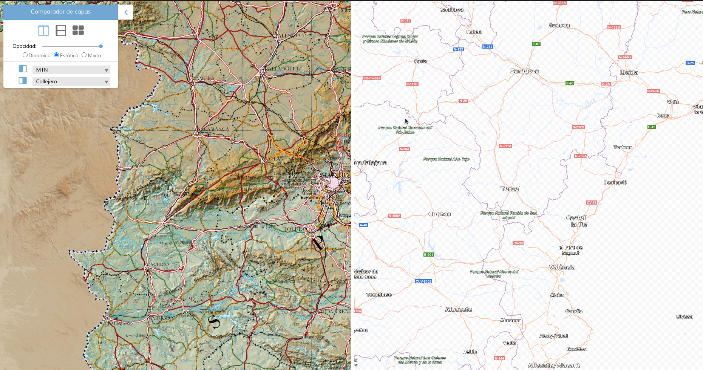
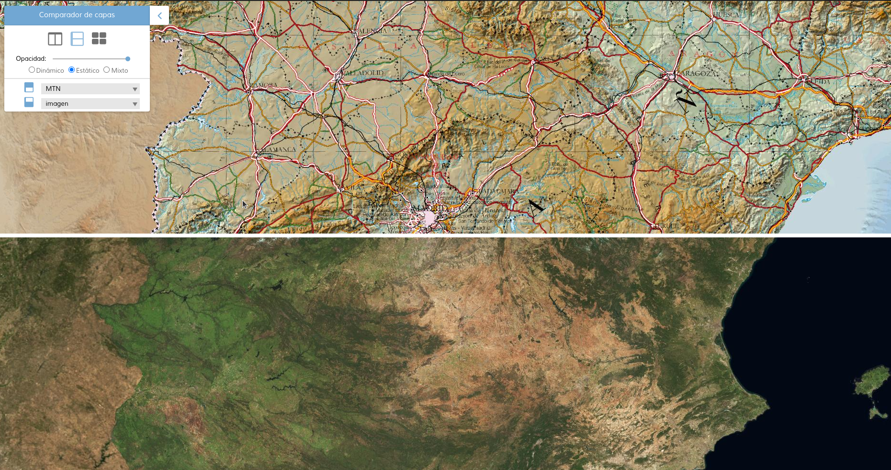
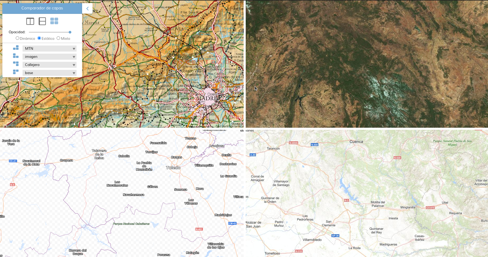

# M.plugin.LyrCompare

Plugin que permite comparar varias capas sobre una cartografía base.

Además disponemos de tres modos de división de las capas:
- **Dinámico**: La extensión de las capas sobre el lienzo viene definida por la posición del ratón.
- **Estático**: La extensión de las capas sobre el lienzo viene definida por el punto medio del lienzo.
- **Mixto**: La extensión de las capas sobre el lienzo viene definida por el punto medio del lienzo con líneas arrastrables.

Podemos seleccionar el modo de comparación:
- **Apagado**: No se muestra ninguna capa.
- **Cortina vertical**: Se muestra una capa a la izquierda y otra a la derecha.
- **Cortina horizontal**: Se muestra una capa arriba y otra abajo.
- **Multivista**: Se muestra una capa en cada esquina.

### Imágen de ejemplo: Cortina vertical


### Imágen de ejemplo: Cortina horizontal


### Imágen de ejemplo: Multivista


# Dependencias

Para que el plugin funcione correctamente es necesario importar las siguientes dependencias en el documento html:

- **lyrcompare.ol.min.js**
- **lyrcompare.ol.min.css**


```html
 <link href="https://componentes.cnig.es/api-core/plugins/lyrcompare/lyrcompare.ol.min.css" rel="stylesheet" />
 <script type="text/javascript" src="https://componentes.cnig.es/api-core/plugins/lyrcompare/lyrcompare.ol.min.js"></script>
```

# Uso del histórico de versiones

Existe un histórico de versiones de todos los plugins de API-CNIG en [api-ign-legacy](https://github.com/IGN-CNIG/API-CNIG/tree/master/api-ign-legacy/plugins) para hacer uso de versiones anteriores.
Ejemplo:
```html
 <link href="https://componentes.cnig.es/api-core/plugins/lyrcompare/lyrcompare-1.0.0.ol.min.css" rel="stylesheet" />
 <script type="text/javascript" src="https://componentes.cnig.es/api-core/plugins/lyrcompare/lyrcompare-1.0.0.ol.min.js"></script>
```

# Parámetros

El constructor se inicializa con un JSON con los siguientes atributos:

- **layers**: Parámetro obligatorio. Array que puede contener el/los nombre/s de la/s capa/s (que está/n en el mapa),
la/s url en formato mapea para insertar una capa a través de servicios WMS ó WMTS, o la capa como objeto.
A esta/s capa/s se le aplicará el efecto de transparencia.

- **position**: Indica la posición donde se mostrará el plugin.
  - 'TL': (top left) - Arriba a la izquierda.
  - 'TR': (top right) - Arriba a la derecha (por defecto).
  - 'BL': (bottom left) - Abajo a la izquierda.
  - 'BR': (bottom right) - Abajo a la derecha.

- **collapsed**: Indica si el plugin viene colapsado de entrada (true/false). Por defecto: true.

- **collapsible**: Indica si el plugin puede abrirse y cerrarse (true) o si permanece siempre abierto (false). Por defecto: true.

- **tooltip**: Información emergente para mostrar en el tooltip del plugin (se muestra al dejar el ratón encima del plugin como información). Por defecto: Comparador de capas.

- **staticDivision**: Permite definir si al arrancar la herramienta dividirá las capas por la posición del ratón *(valor 0)*, por el punto medio *(valor 1)* o por el punto medio con líneas arrastrables *(valor 2)*. Es decir, modo dinámico (valor 0), estático (valor 1) o mixto (valor 2). En el modo dinámico, el zoom no se podrá modificar. Por defecto: 1.

- **opacityVal**: Define el valor de la opacidad que se aplicará a las capas que se muestran sobre la cartografía base. Rango de 0 a 100. Por defecto: 100.

- **comparisonMode**: Define el tipo de comparación con la que arranca. Rango de 0 a 3.
  - 0: arranca con el modo de comparación apagado (por defecto).
  - 1: arranca con el modo de comparación cortina vertical.
  - 2: arranca con el modo de comparación de cortina horizontal.
  - 3: arranca con el modo de comparación múltiple de cuatro capas.

  Para ver el efecto de cada uno podemos acceder al test https://mapea-lite.desarrollo.guadaltel.es/api-core/lyrcompare.jsp?language=es y cambiar las opciones.


- **defaultLyrA**: Define la capa que se cargará en la primera posición. Valores de 0 al número de capas disponibles - 1 (Ejemplo: si hay 6 capas: de 0 a 5). No se puede repetir el valor, si en defaultLyrA se indica 0, no se puede indicar 0 en defaultLyrB, defaultLyrC o defaultLyrD. Por defecto: 0.

- **defaultLyrB**: Define la capa que se cargará en la segunda posición. Valores de 0 al número de capas disponibles - 1 (Ejemplo: si hay 6 capas: de 0 a 5). No se puede repetir el valor, si en defaultLyrB se indica 0, no se puede indicar 0 en defaultLyrA, defaultLyrC o defaultLyrD. Por defecto: 1.

- **defaultLyrC**: Define la capa que se cargará en la tercera posición. Valores de 0 al número de capas disponibles - 1 (Ejemplo: si hay 6 capas: de 0 a 5). No se puede repetir el valor, si en defaultLyrC se indica 0, no se puede indicar 0 en defaultLyrA, defaultLyrB o defaultLyrD. Por defecto: 2.

- **defaultLyrD**: Define la capa que se cargará en la cuarta posición. Valores de 0 al número de capas disponibles - 1 (Ejemplo: si hay 6 capas: de 0 a 5). No se puede repetir el valor, si en defaultLyrD se indica 0, no se puede indicar 0 en defaultLyrA, defaultLyrB o defaultLyrC. Por defecto: 3.

# Ejemplos de uso

## Ejemplo 1
Insertar capas WMS con formato Mapea.
El modo de comparación es 0, por lo que no se iniciará al cargarlo.
El modo de división es 1 por lo que será estático.
La interfaz está activa.

```javascript
const pluginLyrCompare = new M.plugin.LyrCompare({
  position: 'TL',
  layers: [
    'WMS*SIGPAC*https://www.ign.es/wms/pnoa-historico*SIGPAC',
    'WMS*OLISTAT*https://www.ign.es/wms/pnoa-historico*OLISTAT',
    'WMS*Nacional_1981-1986*https://www.ign.es/wms/pnoa-historico*Nacional_1981-1986',
    'WMS*Interministerial_1973-1986*https://www.ign.es/wms/pnoa-historico*Interministerial_1973-1986',
  ],
  collapsible: true,
  collapsed: true,
  tooltip: "Comparador de capas",
  staticDivision: 1,
  opacityVal: 100,
  comparisonMode: 0,
  defaultLyrA: 0,
  defaultLyrB: 1,
  defaultLyrC: 2,
  defaultLyrD: 3,
});
map.addPlugin(pluginLyrCompare);
```


## Ejemplo 2
Al no indicar capas mostrará un error en pantalla: El número de capas es insuficiente para aplicar el efecto.

```javascript
const pluginLyrCompare = new M.plugin.LyrCompare({
  position: 'TL',
  collapsed: false,
  collapsible: true,
  tooltip: "Comparador de capas",
  staticDivision: 1,
  opacityVal: 100,
  comparisonMode: 0,
  defaultLyrA: 0,
  defaultLyrB: 1,
  defaultLyrC: 2,
  defaultLyrD: 3,
});
map.addPlugin(pluginLyrCompare);
```

## Ejemplo 3
WMS con formato Mapea y sin interfaz.

```javascript
const pluginLyrCompare = new M.plugin.LyrCompare({
  position: 'TL',
  layers: [
    'WMS*SIGPAC*https://www.ign.es/wms/pnoa-historico*SIGPAC',
    'WMS*OLISTAT*https://www.ign.es/wms/pnoa-historico*OLISTAT',
    'WMS*Nacional_1981-1986*https://www.ign.es/wms/pnoa-historico*Nacional_1981-1986',
    'WMS*Interministerial_1973-1986*https://www.ign.es/wms/pnoa-historico*Interministerial_1973-1986',
  ],
  collapsed: true,
  collapsible: true,
  tooltip: "Comparador de capas",
  staticDivision: 0,
  opacityVal: 100,
  comparisonMode: 2,
  defaultLyrA: 0,
  defaultLyrB: 1,
  defaultLyrC: 2,
  defaultLyrD: 3,
});
map.addPlugin(pluginLyrCompare);
```


## Ejemplo 4
WMTS con formato Mapea y sin interfaz.

```javascript
const pluginLyrCompare = new M.plugin.LyrCompare({
  position: 'TL',
  layers: [
    'WMTS*https://www.ign.es/wmts/mapa-raster?*MTN*GoogleMapsCompatible*MTN*true*image/jpeg*false*false*true',
    'WMTS*https://www.ign.es/wmts/pnoa-ma?*OI.OrthoimageCoverage*GoogleMapsCompatible*imagen*false*image/jpeg*false*false*true',
    'WMTS*https://www.ign.es/wmts/ign-base?*IGNBaseOrto*GoogleMapsCompatible*Callejero*true*image/png*false*false*true',
    'WMTS*https://www.ign.es/wmts/ign-base?*IGNBaseTodo*GoogleMapsCompatible*base*false*image/jpeg*false*false*true',
  ],
  collapsed: false,
  collapsible: true,
  tooltip: "Comparador de capas",
  staticDivision: 1,
  opacityVal: 100,
  comparisonMode: 1,
  defaultLyrA: 0,
  defaultLyrB: 1,
  defaultLyrC: 2,
  defaultLyrD: 3,
});
map.addPlugin(pluginLyrCompare);
```

## Ejemplo 5
WMS como objeto.

```javascript
const wms1 = new M.layer.WMS('WMS*SIGPAC*https://www.ign.es/wms/pnoa-historico*SIGPAC');
const wms2 = new M.layer.WMS('WMS*OLISTAT*https://www.ign.es/wms/pnoa-historico*OLISTAT');
const wms3 = new M.layer.WMS('WMS*Nacional_1981-1986*https://www.ign.es/wms/pnoa-historico*Nacional_1981-1986');
const wms4 = new M.layer.WMS('WMS*Interministerial_1973-1986*https://www.ign.es/wms/pnoa-historico*Interministerial_1973-1986');
map.addLayers([wms1, wms2, wms3, wms4]);

const pluginLyrCompare = new M.plugin.LyrCompare({
  position: 'TL',
  layers: [
    wms1, wms2, wms3, wms4
  ],
  collapsed: false,
  collapsible: true,
  tooltip: "Comparador de capas",
  staticDivision: 1,
  comparisonMode: 1,
});
map.addPlugin(pluginLyrCompare);
```

## Ejemplo 6
WMTS como objeto.

```javascript
const wmts1 = new M.layer.WMTS('WMTS*https://www.ign.es/wmts/mapa-raster?*MTN*GoogleMapsCompatible*MTN*true*image/jpeg*false*false*true');
const wmts2 = new M.layer.WMTS('WMTS*https://www.ign.es/wmts/pnoa-ma?*OI.OrthoimageCoverage*GoogleMapsCompatible*imagen*false*image/jpeg*false*false*true');
const wmts3 = new M.layer.WMTS('WMTS*https://www.ign.es/wmts/ign-base?*IGNBaseOrto*GoogleMapsCompatible*Callejero*true*image/png*false*false*true');
const wmts4 = new M.layer.WMTS('WMTS*https://www.ign.es/wmts/ign-base?*IGNBaseTodo*GoogleMapsCompatible*base*false*image/jpeg*false*false*true');
map.addLayers([wmts1, wmts2, wmts3, wmts4]);

const pluginLyrCompare = new M.plugin.LyrCompare({
  position: 'TL',
  layers: [
    wmts1, wmts2, wmts3, wmts4
  ],
  collapsed: false,
  collapsible: true,
  tooltip: "Comparador de capas",
  staticDivision: 1,
  comparisonMode: 1,
});
map.addPlugin(pluginLyrCompare);
```

## Ejemplo 7
WMS + WMTS como objeto.

```javascript
const wms1 = new M.layer.WMS('WMS*SIGPAC*https://www.ign.es/wms/pnoa-historico*SIGPAC');
const wms2 = new M.layer.WMS('WMS*OLISTAT*https://www.ign.es/wms/pnoa-historico*OLISTAT');
const wmts1 = new M.layer.WMTS('WMTS*https://www.ign.es/wmts/mapa-raster?*MTN*GoogleMapsCompatible*MTN*true*image/jpeg*false*false*true');
const wmts2 = new M.layer.WMTS('WMTS*https://www.ign.es/wmts/pnoa-ma?*OI.OrthoimageCoverage*GoogleMapsCompatible*imagen*false*image/jpeg*false*false*true');
map.addLayers([wms1, wms2, wmts1, wmts2]);

const pluginLyrCompare = new M.plugin.LyrCompare({
  position: 'TL',
  layers: [
    wms1, wms2, wmts1, wmts2
  ],
  collapsed: true,
  collapsible: true,
  tooltip: "Comparador de capas",
  staticDivision: 1,
  comparisonMode: 1,
});
map.addPlugin(pluginLyrCompare);
```

