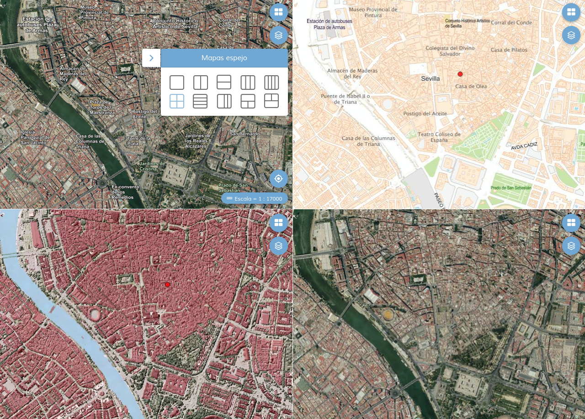

# M.plugin.Mirrorpanel

Plugin que permite comparar varias capas dividiendo la pantalla en varias partes. Los mapas tienen sus vistas sincronizadas, y podemos ver la representación de una misma zona por distintas capas.




# Dependencias

- mirrorpanel.ol.min.js
- mirrorpanel.ol.min.css


```html
 <link href="../../plugins/mirrorpanel/mirrorpanel.ol.min.css" rel="stylesheet" />
 <script type="text/javascript" src="../../plugins/mirrorpanel/mirrorpanel.ol.min.js"></script>
```

# Uso del histórico de versiones

Existe un histórico de versiones de todos los plugins de API-CNIG en [api-ign-legacy](https://github.com/IGN-CNIG/API-CNIG/tree/master/api-ign-legacy/plugins) para hacer uso de versiones anteriores.
Ejemplo:
```html
 <link href="https://componentes.cnig.es/api-core/plugins/mirrorpanel/mirrorpanel-1.0.0.ol.min.css" rel="stylesheet" />
 <script type="text/javascript" src="https://componentes.cnig.es/api-core/plugins/mirrorpanel/mirrorpanel-1.0.0.ol.min.js"></script>
```

# Parámetros

El constructor se inicializa con un JSON de options con los siguientes atributos:

- **position**: Indica la posición donde se mostrará el plugin.
  - 'TL': (top left) - Arriba a la izquierda.
  - 'TR': (top right) - Arriba a la derecha (por defecto).
  - 'BL': (bottom left) - Abajo a la izquierda.
  - 'BR': (bottom right) - Abajo a la derecha.

- **collapsed**: Indica si el plugin viene colapsado de entrada (true/false). Por defecto: true.

- **collapsible**: Indica si el plugin puede abrirse y cerrarse (true) o si permanece siempre abierto (false). Por defecto: true.

- **modeViz**: Define el tipo de comparación con la que arranca. Rango 0-9.
  - 0: mapa simple.
  - 1: dos mapas en vertical.
  - 2: dos mapas en horizontal.
  - 3: tres mapas en vertical.
  - 4: cuatro mapas en vertical.
  - 5: mosaico con cuatro mapas.
  - 6: cuatro mapas en horizontal.
  - 7: tres mapas en proporción 2-1-1.
  - 8: un mapa arriba y dos abajo.
  - 9: dos mapas arriba y uno abajo.

- **enabledPlugins**: Si es *true*, los mapas espejo importan los plugins **M.plugin.FullTOC** y **M.plugin.BackImgLayer** si los hubiera, y en caso de hacerlos los añade a los mapas espejo. Por defecto tiene el valor *true*.

- **enabledKeyFunctions**: Si es *true*, se pueden usar las combinaciones de teclas Ctrl + Shift + [F1-F8] para cambiar entre los distintos modos de visualización. Con la tecla *Escape* se destruye el plugin. Por defecto tiene el valor *true*.

- **showCursors**: Si es *true*, muestra cursores sincronziados en cda unao de los mapas espejo. Por defecto tiene el valor *true*.

- **mirrorLayers**: Es un array de capas para mostrar en los mapas espejo y poder compararlas entre sí.

- **defaultBaseLyrs**: Es un array de capas para mostrar como mapa por defecto cuando no se importa del mapa principal un plugin **M.plugin.BackImgLayer** o cuando la propiedad *enabledPlugins* es *false*.

- **backImgLayersParams**: Es un objeto con todos los parámetros del plugin **M.plugin.BackImgLayer** de los mapas espejo.

- **interface**: Define si mostrar o no la interfaz del plugin.
- **tooltip**. Tooltip que se muestra sobre el plugin.

# Multi idioma

Actualmente viene preparado para español e inglés. Para definir con qué idioma arranca, hay que ir al fichero test.js y modificar.

```javascript
M.language.setLang('es');//Idioma español
M.language.setLang('en');//Idioma inglés
```
Se pueden crear más ficheros de idioma. Basta con copiar la estructura de los ficheros **json** de la carpeta *\src\facade\js\i18n* , renombrar con la abreviatura del nuevo idioma (fr para el fránces), y cambiar los textos, manteniendo las *keywords*.

# Ejemplos de uso

## Ejemplo base

```javascript
const map = M.map({
   container: 'mapjs',
   center: {
      x: -667143.31,
      y: 4493011.77,
   },
   projection: "EPSG:3857*m",
   zoom: 15,
});

const mpMirrorPanel = new M.plugin.Mirrorpanel();
map.addPlugin(mpMirrorPanel);
```

## Ejemplo 1

```javascript
const map = M.map({
   container: 'mapjs',
   center: {
      x: -667143.31,
      y: 4493011.77,
   },
   projection: "EPSG:3857*m",
   zoom: 15,
});

const mpMirrorPanel = new M.plugin.Mirrorpanel({
  position: 'TR',
  collapsible: true,
  collapsed: false,
  modeViz: 0,
  enabledPlugins: true,
  enabledKeyFunctions: true,
  showCursors: true,
  defaultBaseLyrs: [
    'WMTS*http://www.ign.es/wmts/mapa-raster?*MTN*GoogleMapsCompatible*MTN',
    'WMTS*http://www.ign.es/wmts/pnoa-ma?*OI.OrthoimageCoverage*GoogleMapsCompatible*PNOA',
    'WMTS*https://wmts-mapa-lidar.idee.es/lidar?*EL.GridCoverageDSM*GoogleMapsCompatible*LiDAR',
  ],
});

map.addPlugin(mpMirrorPanel);
```

## Ejemplo 2
### Con plugin BackImgLayers

```javascript
const map = M.map({
   container: 'mapjs',
   center: {
      x: -667143.31,
      y: 4493011.77,
   },
   projection: "EPSG:3857*m",
   zoom: 15,
});

let backImgLayerParams = {
  position: 'TR',
  collapsible: true,
  collapsed: true,
  layerId: 0,
  layerVisibility: true,
  layerOpts: [
    {
      id: 'mapa',
      preview: 'http://componentes.ign.es/api-core/plugins/backimglayer/images/svqmapa.png',
      title: 'Mapa',
      layers: [new M.layer.WMTS({
        url: 'http://www.ign.es/wmts/ign-base?',
        name: 'IGNBaseTodo',
        legend: 'Mapa IGN',
        matrixSet: 'GoogleMapsCompatible',
        transparent: false,
        displayInLayerSwitcher: false,
        queryable: false,
        visible: true,
        format: 'image/jpeg',
      })],
    },
    {
      id: 'imagen',
      title: 'Imagen',
      preview: 'http://componentes.ign.es/api-core/plugins/backimglayer/images/svqimagen.png',
      layers: [new M.layer.WMTS({
        url: 'http://www.ign.es/wmts/pnoa-ma?',
        name: 'OI.OrthoimageCoverage',
        legend: 'Imagen (PNOA)',
        matrixSet: 'GoogleMapsCompatible',
        transparent: false,
        displayInLayerSwitcher: false,
        queryable: false,
        visible: true,
        format: 'image/jpeg',
      })],
    },
    {
      id: 'raster',
      preview: '../src/templates/img/svqmtn.png',
      title: 'Ráster',
      layers: [new M.layer.WMTS({
        url: 'http://www.ign.es/wmts/mapa-raster?',
        name: 'MTN',
        legend: 'Mapa IGN',
        matrixSet: 'GoogleMapsCompatible',
        transparent: false,
        displayInLayerSwitcher: false,
        queryable: false,
        visible: true,
        format: 'image/jpeg',
      })],
    },
    {
      id: 'hibrido',
      title: 'Híbrido',
      preview: 'http://componentes.ign.es/api-core/plugins/backimglayer/images/svqhibrid.png',
      layers: [new M.layer.WMTS({
        url: 'http://www.ign.es/wmts/pnoa-ma?',
        name: 'OI.OrthoimageCoverage',
        legend: 'Imagen (PNOA)',
        matrixSet: 'GoogleMapsCompatible',
        transparent: true,
        displayInLayerSwitcher: false,
        queryable: false,
        visible: true,
        format: 'image/png',
      }),
      new M.layer.WMTS({
        url: 'http://www.ign.es/wmts/ign-base?',
        name: 'IGNBaseOrto',
        matrixSet: 'GoogleMapsCompatible',
        legend: 'Mapa IGN',
        transparent: false,
        displayInLayerSwitcher: false,
        queryable: false,
        visible: true,
        format: 'image/png',
      })
      ],
    },
  ],
}
const mpBIL = new M.plugin.BackImgLayer(backImgLayerParams);
map.addPlugin(mpBIL);

const mpMirrorPanel = new M.plugin.Mirrorpanel({
  position: 'TR',
  collapsible: true,
  collapsed: false,
  modeViz: 0,
  enabledPlugins: true,
  enabledKeyFunctions: true,
  showCursors: true,
  backImgLayersParams: backImgLayerParams
});

map.addPlugin(mpMirrorPanel);
```
