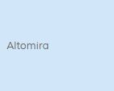
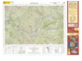
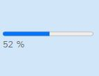

<p align="center">
  
</p>
<h1 align="center"><strong>APICNIG</strong> <small>🔌 M.plugin.QueryAttributes</small></h1>

# Descripción

Plugin que permite aplicar filtros sobre las capas de un mapa y visualizar de forma gráfica las features que cumplen los filtros. Permite guardar consultas, combinarlas y exportar los resultados de estas.

# Dependencias

Para que el plugin funcione correctamente es necesario importar las siguientes dependencias en el documento html:

- **queryattributes.ol.min.js**
- **queryattributes.ol.min.css**

```html
 <link href="https://componentes.cnig.es/api-core/plugins/queryattributes/queryattributes.ol.min.css" rel="stylesheet" />
 <script type="text/javascript" src="https://componentes.cnig.es/api-core/plugins/queryattributes/queryattributes.ol.min.js"></script>
```

# Uso del histórico de versiones

Existe un histórico de versiones de todos los plugins de API-CNIG en [api-ign-legacy](https://github.com/IGN-CNIG/API-CNIG/tree/master/api-ign-legacy/plugins) para hacer uso de versiones anteriores.
Ejemplo:
```html
 <link href="https://componentes.cnig.es/api-core/plugins/queryattributes/queryattributes-1.0.0.ol.min.css" rel="stylesheet" />
 <script type="text/javascript" src="https://componentes.cnig.es/api-core/plugins/queryattributes/queryattributes-1.0.0.ol.min.js"></script>
```

# Parámetros

El constructor se inicializa con un JSON con los siguientes atributos:

- **position**: Indica la posición donde se mostrará el plugin.
  - 'TL': (top left) - Arriba a la izquierda (por defecto).
  - 'TR': (top right) - Arriba a la derecha.
  - 'BL': (bottom left) - Abajo a la izquierda.
  - 'BR': (bottom right) - Abajo a la derecha.
- **collapsed**: Indica si el plugin viene colapsado de entrada (true/false). Por defecto: true.
- **collapsible**: Indica si el plugin puede abrirse y cerrarse (true) o si permanece siempre abierto (false). Por defecto: true.
- **tooltip**. Tooltip que se muestra sobre el plugin. Por defecto: Tabla de atributos.
- **filters**: Cuando toma el valor false, en cada cambio de zoom muestra en la tabla los registros que se encuentran en el bounding box de la pantalla. Cuando toma valor true, muestra botones para establecer filtro por bounding box o por polígono trazado por el usuario. Por defecto: true.
- **refreshBBOXFilterOnPanning**: define el comportamiento del filtro de vista al activarse. Si es *true*, se reevalúa después de cada panning o cambio de zoom. Si su valor es *false*, sólo se aplica la primera vez con los elementos en pantalla, y no se vuelve a calcular después de cada panning. Por defecto es *false*.
- **configuration**: aquí definimos el aspecto y el tratamiento de los campos de la capa vectorial dentro de la tabla de atributos. Si no se define, aparece por consola una alerta y se carga una configuración por defecto. Por defecto: { columns: [] }
  - **layer**: nombre de la capa cuyos elementos se mostrarán en la tabla de atributos, especificada en su propiedad *name*.
  - **pk**: nombre del atributo que actúa como clave principal.
  - **initialsort**: aquí indicamos el campo por el que se ordena inicialmente
    - **name**: nombre del campo para ordenar.
    - **dir**: sentido de ordenación [asc, desc]
  - **columns**: array de objetos con la definición de los campos para la tabla de atributos

### 🔸 Definición de campos

Cada campo de la capa vectorial necesita un objeto para definirlo. Los atributos del objeto son:

* **name**: nombre del campo en el *feature*.
* **alias**: denominación del campo para mostrar.
* **visible**: true/false. Se muestra o no en la tabla.
* **searchable**: true/false. Indicamos si el campo atiende a filtros de texto.
* **showpanelinfo**: true/false. Indicamos si el campo se muestra o no en la ventana de información.
* **align**: right/left. Alineación horizontal en la celdilla de la tabla
* **type**: tipo del campo
  * **string**: tipo de cadena. Por defecto.
  * **image**: contiene la URL de una imagen. La imagen se  mostrará en la tabla.
  * **linkURL**: contiene una URL. Se muestra dentro de un hipervínculo.
  * **buttonURL**: contiene una URL. Se muestra dentro de un botón.
  * **formatter**: repite un carácter formateado un número especificado de veces.
  * **percentage**: muestra el valor formateado en una barra de progreso.
* **typeparam**: parámetros para complementar al atributo *type*.
  * **buttonURL**: texto que figura en el botón.
  * **formatter**: valor que se repite.

# API-REST

```javascript
URL_API?queryattributes=position*collapsed*collapsible*tooltip*filters*refreshBBOXFilterOnPanning
```

<table>
  <tr>
    <th>Parámetros</th>
    <th>Opciones/Descripción</th>
    <th>Disponibilidad</th>
  </tr>
  <tr>
    <td>position</td>
    <td>TR/TL/BR/BL</td>
    <td>Base64 ✔️  | Separador ✔️ </td>
  </tr>
  <tr>
    <td>collapsed</td>
    <td>true/false</td>
    <td>Base64 ✔️  | Separador ✔️ </td>
  </tr>
  <tr>
    <td>collapsible</td>
    <td>true/false</td>
    <td>Base64 ✔️  | Separador ✔️ </td>
  </tr>
  <tr>
    <td>tooltip</td>
    <td>Valor que se muestra sobre el plugin</td>
    <td>Base64 ✔️  | Separador ✔️ </td>
  </tr>
  <tr>
    <td>filters</td>
    <td>true/false</td>
    <td>Base64 ✔️  | Separador ✔️ </td>
  </tr>
  <tr>
    <td>refreshBBOXFilterOnPanning</td>
    <td>true/false</td>
    <td>Base64 ✔️  | Separador ✔️ </td>
  </tr>
  <tr>
    <td>configuration</td>
    <td>{layer:'', pk:'', initialSort: { name:'', dir:''}, columns: [ ]}</td>
    <td>Base64 ✔️  | Separador ❌ </td>
  </tr>
</table>


### Ejemplo de uso API-REST

```
https://componentes.cnig.es/api-core?queryattributes=TR*true*true*atributos*true*true
```

### Ejemplo de uso API-REST en base64

Para la codificación en base64 del objeto con los parámetros del plugin podemos hacer uso de la utilidad M.utils.encodeBase64.
Ejemplo:
```javascript
M.utils.encodeBase64(obj_params);
```

En este ejemplo se utiliza el parámetro *configuration* para que la tabla muestre los atributos de la capa *vertices*.
Se le pasa la capa vertices por url añadiendo lo siguiente: ``` &layers=GeoJSON*vertices*https://projects.develmap.com/attributestable/roivertexcenterred.geojson*true ```

Ejemplo de constructor del plugin:
``` javascript
{
  position: 'TL',
  tooltip: 'Consulta de atributos',
  refreshBBOXFilterOnPanning: true,
  configuration: {
    layer: 'vertices',
    pk: 'id',
    initialSort: { name: 'nombre', dir: 'asc' },
    columns: [
      { name: 'id', alias: 'Identificador', visible: false, searchable: false, showpanelinfo: true, align: 'right', type: 'string'},
      { name: 'nombre', alias: 'Nombre Vértice', visible: true, searchable: true, showpanelinfo: true, align: 'left', type: 'string'},
      { name: 'urlficha', alias: 'URL PDF Ficha', visible: true, searchable: false, showpanelinfo: true, align: 'left', type: 'linkURL', typeparam:'Ficha vértice'},
      { name: 'imagemtn50', alias: 'Imagen Hoja MTN50', visible: true, searchable: false, showpanelinfo: true, align: 'left', type: 'image'},
    ],
  },
}
```
```
https://componentes.cnig.es/api-core/?queryattributes=base64=eyJwb3NpdGlvbiI6IlRMIiwidG9vbHRpcCI6IkNvbnN1bHRhIGRlIGF0cmlidXRvcyIsInJlZnJlc2hCQk9YRmlsdGVyT25QYW5uaW5nIjp0cnVlLCJjb25maWd1cmF0aW9uIjp7ImxheWVyIjoidmVydGljZXMiLCJwayI6ImlkIiwiaW5pdGlhbFNvcnQiOnsibmFtZSI6Im5vbWJyZSIsImRpciI6ImFzYyJ9LCJjb2x1bW5zIjpbeyJuYW1lIjoiaWQiLCJhbGlhcyI6IklkZW50aWZpY2Fkb3IiLCJ2aXNpYmxlIjpmYWxzZSwic2VhcmNoYWJsZSI6ZmFsc2UsInNob3dwYW5lbGluZm8iOnRydWUsImFsaWduIjoicmlnaHQiLCJ0eXBlIjoic3RyaW5nIn0seyJuYW1lIjoibm9tYnJlIiwiYWxpYXMiOiJOb21icmUgVsOpcnRpY2UiLCJ2aXNpYmxlIjp0cnVlLCJzZWFyY2hhYmxlIjp0cnVlLCJzaG93cGFuZWxpbmZvIjp0cnVlLCJhbGlnbiI6ImxlZnQiLCJ0eXBlIjoic3RyaW5nIn0seyJuYW1lIjoidXJsZmljaGEiLCJhbGlhcyI6IlVSTCBQREYgRmljaGEiLCJ2aXNpYmxlIjp0cnVlLCJzZWFyY2hhYmxlIjpmYWxzZSwic2hvd3BhbmVsaW5mbyI6dHJ1ZSwiYWxpZ24iOiJsZWZ0IiwidHlwZSI6ImxpbmtVUkwiLCJ0eXBlcGFyYW0iOiJGaWNoYSB2w6lydGljZSJ9LHsibmFtZSI6ImltYWdlbXRuNTAiLCJhbGlhcyI6IkltYWdlbiBIb2phIE1UTjUwIiwidmlzaWJsZSI6dHJ1ZSwic2VhcmNoYWJsZSI6ZmFsc2UsInNob3dwYW5lbGluZm8iOnRydWUsImFsaWduIjoibGVmdCIsInR5cGUiOiJpbWFnZSJ9XX19&layers=GeoJSON*vertices*https://projects.develmap.com/attributestable/roivertexcenterred.geojson*true,TMS*TMSBaseIGN*https://tms-ign-base.idee.es/1.0.0/IGNBaseTodo/%7Bz%7D/%7Bx%7D/%7B-y%7D.jpeg*true*false*17
```

# Ejemplo de uso

```javascript
const map = M.map({
  container: 'map'
});

const mp = new QueryAttributes({
  position: 'TL',
  collapsed: true,
  collapsible: true,
  filters: true,
  configuration: {
    layer: 'vertices',
    pk: 'id',
    initialSort: { name: 'nombre', dir: 'asc' },
    columns: [
      {
          name: 'id',
          alias: 'Identificador',
          visible: false,
          searchable: false ,
          showpanelinfo: true,
          align: 'right',
          type: 'string'},
      { name: 'nombre', alias: 'Nombre Vértice', visible: true, searchable: true, showpanelinfo: true, align: 'left', type: 'string'},
      { name: 'xutmetrs89', alias: 'Coordenada X', visible: false, searchable: true, showpanelinfo: true, align: 'left', type: 'string'},
      { name: 'yutmetrs89', alias: 'Coordenada Y', visible: false, searchable: true, showpanelinfo: true, align: 'left', type: 'string'},
      { name: 'horto', alias: 'Altitud Ortométrica', visible: false, searchable: true, showpanelinfo: true, align: 'left', type: 'string'},
      { name: 'calidad', alias: 'Calidad', visible: false, searchable: true, showpanelinfo: true, align: 'left', type: 'formatter', typeparam:'*'},
      { name: 'nivel', alias: 'Vida útil', visible: true, searchable: true, showpanelinfo: true, align: 'left', type: 'percentage'},
      { name: 'urlficha', alias: 'URL PDF Ficha', visible: true, searchable: true, showpanelinfo: true, align: 'left', type: 'linkURL'},
      { name: 'urlcdd', alias: 'Descargas', visible: true, searchable: true, showpanelinfo: true, align: 'left', type: 'buttonURL', typeparam:'Acceder'},
      { name: 'nivel', alias: 'Vida útil', visible: true, searchable: true, showpanelinfo: true, align: 'left', type: 'percentage'},
      { name: 'hojamtn50', alias: 'Hoja MTN50', visible: false, searchable: true, showpanelinfo: true, align: 'right', type: 'string'},
      { name: 'summary', alias: 'Localización', visible: false, searchable: true, showpanelinfo: true, align: 'left', type: 'string'},
      { name: 'imagemtn50', alias: 'Imagen Hoja MTN50', visible: true, searchable: true, showpanelinfo: true, align: 'left', type: 'image'},
    ],
  }
});

map.addPlugin(mp);
```


## 📸 Capturas

### 🔸 Elementos de estilo

||||
|:----:|:----:|:----:|
|string|Image|percentage|
||||
|linkURL|buttonURL|formatter|
||||

### 🔸 Tabla de elementos


### 🔸 Ventana de información


# 👨‍💻 Desarrollo

Para el stack de desarrollo de este componente se ha utilizado

* NodeJS Version: 14.16
* NPM Version: 6.14.11
* Entorno Windows.

## 📐 Configuración del stack de desarrollo / *Work setup*


### 🐑 Clonar el repositorio / *Cloning repository*

Para descargar el repositorio en otro equipo lo clonamos:

```bash
git clone [URL del repositorio]
```

### 1️⃣ Instalación de dependencias / *Install Dependencies*

```bash
npm i
```

### 2️⃣ Arranque del servidor de desarrollo / *Run Application*

```bash
npm run start
```

## 📂 Estructura del código / *Code scaffolding*

```any
/
├── src 📦                  # Código fuente
├── task 📁                 # EndPoints
├── test 📁                 # Testing
├── webpack-config 📁       # Webpack configs
└── ...
```
## 📌 Metodologías y pautas de desarrollo / *Methodologies and Guidelines*

Metodologías y herramientas usadas en el proyecto para garantizar el Quality Assurance Code (QAC)

* ESLint
  * [NPM ESLint](https://www.npmjs.com/package/eslint) \
  * [NPM ESLint | Airbnb](https://www.npmjs.com/package/eslint-config-airbnb)

## ⛽️ Revisión e instalación de dependencias / *Review and Update Dependencies*

Para la revisión y actualización de las dependencias de los paquetes npm es necesario instalar de manera global el paquete/ módulo "npm-check-updates".

```bash
# Install and Run
$npm i -g npm-check-updates
$ncu
```
