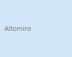
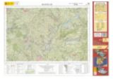
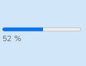
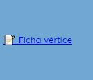
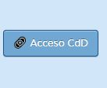
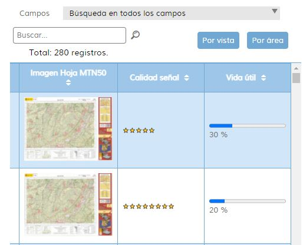

<p align="center">
  
</p>
<h1 align="center"><strong>APICNIG</strong> <small>🔌 M.plugin.QueryDatabase</small></h1>

<p align="center">
  <a title="MIT License" href="LICENSE.md">
    
  </a>
  <a title="Node version" href="#">
    
  </a>  
  <a title="NPM version" href="#">
    
  </a>  
  <br />
  <br />
</p>

## Descripción 👷

Plugin que permite consultar los datos geométricos de una base de datos y visualizar de forma gráfica las features obtenidas así como realizar consultas filtradas.

## Dependencias 👷

- querydatabase.ol.min.js
- querydatabase.ol.min.css

```html
 <link href="../../plugins/querydatabase/querydatabase.ol.min.css" rel="stylesheet" />
 <script type="text/javascript" src="../../plugins/querydatabase/querydatabase.ol.min.js"></script>
```

## Parámetros 👷

El constructor se inicializa con un JSON de _options_ con los siguientes atributos:

- **collapsed**. Indica si el plugin viene cerrado por defecto (true/false).
- **collapsible**. Indica si el plugin se puede cerrar (true/false).
- **position**. Indica la posición donde se mostrará el plugin
  - 'TL':top left (default)
  - 'TR':top right
  - 'BL':bottom left
  - 'BR':bottom right


## Ejemplo de definición del plugin

```javascript

const map = M.map({
  container: 'map'
});

const mp = new QueryDatabase({
  position: 'TL',
  collapsed: true,
  collapsible: true,
});

map.addPlugin(mp);
```


## ✅ Terminado

* Nueva documentación del plugin.
* Mejora del aspecto visual de la información mostrada con la incorporación de elementos como imágenes, barras de progreso, formateadores de texto, aspecto visual de los hipervínculos
* Las búsquedas por texto se realizan al cambiar el contenido de la caja de texto o al pulsar sobre la lupita.
* Definimos el atributo con la clave principal de *featureset*. De esa manera no es necesario que la primera columna contenga este valor.
* Mostramos información del número de elementos en la tabla y el número de elementos del filtro aplicado. *Spinner* para marcar tiempos de búsqueda.
* Nuevos tipos de valores para dar más opciones de renderizar los valores.
* Al pinchar en un feature, debe abrirse el panel de QueryAttributtes si está colapsado. Falta cambiar el botón. Comprobar secuencia con el Chrome Inspector.
* Podemos definir en qué campos se realizan búsquedas de texto, utilizando la propiedad *searchable*.
* Parametrizable con una *whitelist* de campos que se muestran en Información.
* Parametrizable con una *whitelist* de campos que se muestran en la tabla.
* Mediante un desplegable con los nombres de los campos *searchables* elegimos si buscamos todos los campos o por uno en particular.
*	Localización y resaltado en mapa del elemento a partir de hacer clic en un registro en registros. El registro debe quedar resaltado también en registros.
* Al hacer clic sobre un elemento en el mapa, resaltar este en mapa, y mostrar resaltado en registros. Si está activado información mostrar la información del elemento. Botón de deseleccionar el elemento en el mapa.
* Mejora del aspecto de los botones con pseudoclass :hover y :active


## ❌ Falta

* Mejorar datos muestra.
* Mejora de la información mostrada:
  * Clips de video
  * Etiquetas con formato
  * Mostrar contenido html en un modal form
* Configuración de ventanas **landscape**. Hay que ver lo que supone esto a prtir de lo que hay montado.
* Detectar la capa donde pincho el *feature*.
* Cuando fuerzo la apertura del *sidebar*, no aparece el botón con el icono de cerrar.
* Iconos para indicar por cual de las columnas se ha ordenado.

## 🔌 Desarrollos para incluir el plugin

### 🔸 Aplicación de nomenclátor

Es necesario preparar una API de consulta del NGBE para que **QueryDatabase** cumpla con las necesidades del visor de Nomenclátor. También a nivel de APICore sería necesario un objeto capa vectorial dinámico: Esta capa recargaría sus elementos cada vez que se realiza un cambio de vista (panning o zooming) mediante una petición al servidor. Esta petición también incluiría la posibilidad de redefinir los patrámetros de los filtro aplicados.

### 🔸 Aplicación de sismología

En este caso es necesario contar con una capa vectorial dinámica pero de tipo temporal, esto es, que refresque sus elementos no por un cambio de vista, sino cada cierto intervalo de tiempo.

### 🔸 Aplicación de web semántica

Necesitamos un ejemplo para ver lo que se quiere. Lo más que podemos intuir es un funcionamiento parecido al de [Catálogo de la Cartoteca](https://www.ign.es/web/catalogo-cartoteca/search-in-map.html). Para esto, necesitamos lo mismo que para el caso de la Aplicación del Nomenclátor.

### 🔸 Aplicación de geocines

Falta depurar la información y montar el prototipo. El resto de las funcionalidades ya están desarrolladas

## 🐛 Problemas

* Al definir cual de los campos actúa como clave principal ya no es necesario quer el campo id aparezca en la tabla. Antes daba fallo. **Solucionado**.
* Cuando al aplicar filtros de texto no se obtienen elementos que lo satisfagan, daba un error al hacer zoom al resultado. **Solucionado**.


string: tipo de cadena. Por defecto.
image: contiene la URL de una imagen. La imagen se mostrarla en la tabla.
linkURL: contiene una URL. Se muestra dentro de un hipervínculo.
buttonURL: contiene una URL. Se muestra dentro de un botón.
formatter: repite un carácter formateado un número especificado de veces.
percentage: muestra el valor formateado en una barra de progreso.

## 📸 Capturas 👷

### 🔸 Elementos de estilo

||||
|:----:|:----:|:----:|
|string|Image|percentage|
||||
|linkURL|buttonURL|formatter|
||||

### 🔸 Tabla de elementos



### 🔸 Ventana de información


## 👨‍💻 Desarrollo

Para el stack de desarrollo de este componente se ha utilizado

* NodeJS Version: 14.16
* NPM Version: 6.14.11

## 📐 Para configurar el stack de desarrollo

### 1️⃣ Instalación de dependencias / *Install Dependencies*

```bash
npm i
```

### 2️⃣ Arranque del servidor de desarrollo / *Run Application*

```bash
npm run start
```

## 📂 Estructura del código / *Code scaffolding*

```any
/
├── assets 🌈               # Recursos
├── src 📦                  # Código fuente.
├── task 📁                 # EndPoints
├── test 📁                 # Testing
├── tmp 📁                  # Destination directory for images.
└── ...
```
## 📌 Metodologías y pautas de desarrollo / *Methodologies and Guidelines*

Metodologías y herramientas usadas en el proyecto para garantizar el Quality Assurance Code (QAC)

* ESLint
  * [NPM ESLint](https://www.npmjs.com/package/eslint) \
  * [NPM ESLint | Airbnb](https://www.npmjs.com/package/eslint-config-airbnb)

## ⛽️ Revisión e instalación de dependencias / *Review and Update Dependencies*

Para la revisión y actualización de las dependencias de los paquetes npm es necesario instalar de manera global el paquete/ módulo "npm-check-updates".

```bash
# Install and Run
$npm i -g npm-check-updates
$ncu
```

## 🚔 Licencia

* [European Union Public Licence v1.2](https://raw.githubusercontent.com/JoseJPR/tutorial-nodejs-cli-system-notification/main/README.md)

## ⛲️ Recursos y Herramientas

* [APICNIG](https://componentes.ign.es/api-core/doc/)
* [Mapea Plugins](https://github.com/sigcorporativo-ja/mapea-plugins)
* [APICNIG Plugins](https://componentes.ign.es/api-core/test.html)
* [Wiki APICNIG](https://github.com/IGN-CNIG/API-CNIG/wiki)
* [Apuntes complementarios](assets/_e2molin.md)
* [Test](https://projects.develmap.com/attributestable/build/)
