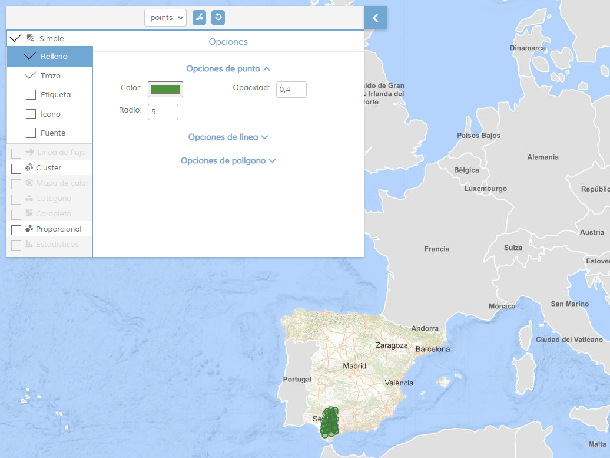

<p align="center">
  
</p>
<h1 align="center"><strong>APICNIG</strong> <small>🔌 M.plugin.StyleManager</small></h1>


# Descripción

Plugin que permite la gestión de la simbología de las capas vectoriales del mapa.

Los tipos de simbología soportada son:
- simple (polígono, línea, punto).
- coropletas.
- símbolos proporcionales.
- categorías.
- estadísticos.
- cluster.
- mapas de calor.

La capa a modificar se selecciona desde el propio plugin, que mantendrá activos únicamente los tipos de simbología compatibles con la capa según su geometría.


La simbología puede ser compuesta, y a medida que se van aplicando simbologías concretas, la interfaz desactiva las que no son compatibles.

En dispositivos móviles, la interfaz se adaptará para ocupar la pantalla completa.


# Dependencias

Para que el plugin funcione correctamente es necesario importar las siguientes dependencias en el documento html:

- **stylemanager.ol.js**
- **stylemanager.min.css**

```html
 <link href="https://componentes.cnig.es/api-core/plugins/stylemanager/stylemanager.ol.min.css" rel="stylesheet" />
 <script type="text/javascript" src="https://componentes.cnig.es/api-core/plugins/stylemanager/stylemanager.ol.min.js"></script>
```

# Uso del histórico de versiones

Existe un histórico de versiones de todos los plugins de API-CNIG en [api-ign-legacy](https://github.com/IGN-CNIG/API-CNIG/tree/master/api-ign-legacy/plugins) para hacer uso de versiones anteriores.
Ejemplo:
```html
 <link href="https://componentes.cnig.es/api-core/plugins/stylemanager/stylemanager-1.0.0.ol.min.css" rel="stylesheet" />
 <script type="text/javascript" src="https://componentes.cnig.es/api-core/plugins/stylemanager/stylemanager-1.0.0.ol.min.js"></script>
```

# Parámetros

El constructor se inicializa con un JSON con los siguientes atributos:

- **position**: Indica la posición donde se mostrará el plugin.
  - 'TL': (top left) - Arriba a la izquierda (por defecto).
  - 'TR': (top right) - Arriba a la derecha.
  - 'BL': (bottom left) - Abajo a la izquierda.
  - 'BR': (bottom right) - Abajo a la derecha.
- **collapsed**: Indica si el plugin viene colapsado de entrada (true/false). Por defecto: true.
- **collapsible**: Indica si el plugin puede abrirse y cerrarse (true) o si permanece siempre abierto (false). Por defecto: true.
- **tooltip**: Texto que se muestra al dejar el ratón encima del plugin. Por defecto: 'Gestor de estilos'.
- **layer**: Capa pre seleccionada (se mostrará seleccionada en el selector de capas del plugin).
Como requisito para usar este parámetro la capa debe de estar cargada en el mapa (ver ejemplo de uso). Además dicha capa debe de tener features (no puede estar vacía).
En caso de que no se cumpla las condiciones anteriores lanzará un error.
(Válido sólo para creación del plugin por JS).

# API-REST

```javascript
URL_API?stylemanager=position*collapsed*collapsible*tooltip
```

<table>
  <tr>
    <th>Parámetros</th>
    <th>Opciones/Descripción</th>
    <th>Disponibilidad</th>
  </tr>
  <tr>
    <td>position</td>
    <td>TR/TL/BR/BL</td>
    <td>Base64 ✔️ | Separador ✔️</td>
  </tr>
  <tr>
    <td>collapsed</td>
    <td>true/false</td>
    <td>Base64 ✔️ | Separador ✔️</td>
  </tr>
  <tr>
    <td>collapsible</td>
    <td>true/false</td>
    <td>Base64 ✔️ | Separador ✔️</td>
  </tr>
  <tr>
    <td>tooltip</td>
    <td>tooltip</td>
    <td>Base64 ✔️ | Separador ✔️</td>
  </tr>
  <tr>
    <td>layer</td>
    <td>Capa pre seleccionada</td>
    <td>Base64 ❌ | Separador ❌</td>
  </tr>
</table>

### Ejemplos de uso API-REST

```
https://componentes.cnig.es/api-core?stylemanager=TR*true*true*tooltip&layers=TMS*TMSBaseIGN*https://tms-ign-base.idee.es/1.0.0/IGNBaseTodo/%7Bz%7D/%7Bx%7D/%7B-y%7D.jpeg*true*false*17,KML*Delegaciones%20IGN*https://www.ign.es/web/resources/delegaciones/delegacionesIGN.kml*true*true
```

```
https://componentes.cnig.es/api-core?stylemanager=TR&layers=TMS*TMSBaseIGN*https://tms-ign-base.idee.es/1.0.0/IGNBaseTodo/%7Bz%7D/%7Bx%7D/%7B-y%7D.jpeg*true*false*17,KML*Delegaciones%20IGN*https://www.ign.es/web/resources/delegaciones/delegacionesIGN.kml*true*true
```

### Ejemplos de uso API-REST en base64

Para la codificación en base64 del objeto con los parámetros del plugin podemos hacer uso de la utilidad M.utils.encodeBase64.
Ejemplo:
```javascript
M.utils.encodeBase64(obj_params);
```

Ejemplo de constructor del plugin:
```javascript
{
  position:'TR',
  collapsible: true,
  collapsed: true,
  tooltip: 'Gestor de estilos'
}
```
```
https://componentes.cnig.es/api-core?stylemanager=base64=eyJwb3NpdGlvbiI6IlRSIiwiY29sbGFwc2libGUiOnRydWUsImNvbGxhcHNlZCI6dHJ1ZSwidG9vbHRpcCI6Ikdlc3RvciBkZSBlc3RpbG9zIn0=&layers=TMS*TMSBaseIGN*https://tms-ign-base.idee.es/1.0.0/IGNBaseTodo/%7Bz%7D/%7Bx%7D/%7B-y%7D.jpeg*true*false*17,KML*Delegaciones%20IGN*https://www.ign.es/web/resources/delegaciones/delegacionesIGN.kml*true*true
```

# Ejemplo de uso

```javascript
const map = M.map({
  container: 'map'
});

// Inicialización con capa
capaVectorial.on(M.evt.LOAD, function() {
  const mp = new M.plugin.StyleManager({
      collapsed: true,
      collapsible: true,
      position: 'TL',
      layer: capaVectorial
  });
  map.addPlugin(mp);
});
```


# 👨‍💻 Desarrollo

Para el stack de desarrollo de este componente se ha utilizado

* NodeJS Version: 14.16
* NPM Version: 6.14.11
* Entorno Windows.

## 📐 Configuración del stack de desarrollo / *Work setup*


### 🐑 Clonar el repositorio / *Cloning repository*

Para descargar el repositorio en otro equipo lo clonamos:

```bash
git clone [URL del repositorio]
```

### 1️⃣ Instalación de dependencias / *Install Dependencies*

```bash
npm i
```

### 2️⃣ Arranque del servidor de desarrollo / *Run Application*

```bash
npm run start
```

## 📂 Estructura del código / *Code scaffolding*

```any
/
├── src 📦                  # Código fuente
├── task 📁                 # EndPoints
├── test 📁                 # Testing
├── webpack-config 📁       # Webpack configs
└── ...
```
## 📌 Metodologías y pautas de desarrollo / *Methodologies and Guidelines*

Metodologías y herramientas usadas en el proyecto para garantizar el Quality Assurance Code (QAC)

* ESLint
  * [NPM ESLint](https://www.npmjs.com/package/eslint) \
  * [NPM ESLint | Airbnb](https://www.npmjs.com/package/eslint-config-airbnb)

## ⛽️ Revisión e instalación de dependencias / *Review and Update Dependencies*

Para la revisión y actualización de las dependencias de los paquetes npm es necesario instalar de manera global el paquete/ módulo "npm-check-updates".

```bash
# Install and Run
$npm i -g npm-check-updates
$ncu
```
