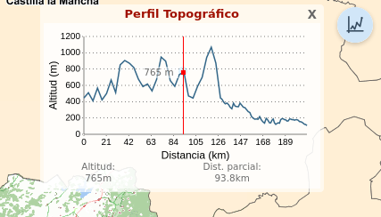

# M.plugin.Topographicprofile

Plugin que permite realizar un perfil longitudinal en función del eje que dibujemos en pantalla



# Dependencias

- topographicprofile.ol.min.js
- topographicprofile.ol.min.css


```html
 <link href="../../plugins/topographicprofile/topographicprofile.ol.min.css" rel="stylesheet" />
 <script type="text/javascript" src="../../plugins/topographicprofile/topographicprofile.ol.min.js"></script>
```

# Uso del histórico de versiones

Existe un histórico de versiones de todos los plugins de API-CNIG en [api-ign-legacy](https://github.com/IGN-CNIG/API-CNIG/tree/master/api-ign-legacy/plugins) para hacer uso de versiones anteriores.
Ejemplo:
```html
 <link href="https://componentes.cnig.es/api-core/plugins/topographicprofile/topographicprofile-1.0.0.ol.min.css" rel="stylesheet" />
 <script type="text/javascript" src="https://componentes.cnig.es/api-core/plugins/topographicprofile/topographicprofile-1.0.0.ol.min.js"></script>
```

# Parámetros

El constructor se inicializa con un JSON de _options_ con los siguientes atributos:

- **position**. Indica la posición donde se mostrará el plugin.
  - 'TL': (top left) - Arriba a la izquierda.
  - 'TR': (top right) - Arriba a la derecha (por defecto).
  - 'BL': (bottom left) - Abajo a la izquierda.
  - 'BR': (bottom right) - Abajo a la derecha.
- **distance**. Discancia, por defecto 30.
- **visible**. Ocultar o mostrar panel. Por defecto true.

# Ejemplos de uso

### Ejemplo 1
```javascript
   const map = M.map({
     container: 'map'
   });

   const mp = new M.plugin.Topographicprofile();

   map.addPlugin(mp);
```
