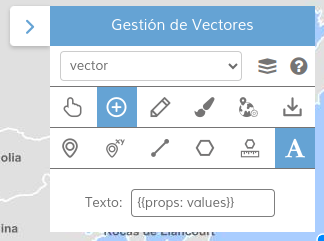

<p align="center">
  
</p>
<h1 align="center"><strong>APICNIG</strong> <small>🔌 M.plugin.VectorsManagement</small></h1>

# Descripción

Plugin que permite el dibujo y edición de geometrías sobre un mapa, cálculo de perfiles topográficos y áreas de influencia, así como su descarga.

# Dependencias
Para que el plugin funcione correctamente es necesario importar las siguientes dependencias en el documento html:

- **vectorsmanagement.ol.min.js**
- **vectorsmanagement.ol.min.css**

```html
 <link href="https://componentes.cnig.es/api-core/plugins/vectorsmanagement/vectorsmanagement.ol.min.css" rel="stylesheet" />
 <script type="text/javascript" src="https://componentes.cnig.es/api-core/plugins/vectorsmanagement/vectorsmanagement.ol.min.js"></script>
```

# Uso del histórico de versiones

Existe un histórico de versiones de todos los plugins de API-CNIG en [api-ign-legacy](https://github.com/IGN-CNIG/API-CNIG/tree/master/api-ign-legacy/plugins) para hacer uso de versiones anteriores.
Ejemplo:
```html
 <link href="https://componentes.cnig.es/api-core/plugins/vectorsmannagement/vectorsmanagement-1.0.0.ol.min.css" rel="stylesheet" />
 <script type="text/javascript" src="https://componentes.cnig.es/api-core/plugins/vectorsmanagement/vectorsmanagement-1.0.0.ol.min.js"></script>
```

# Parámetros

El constructor se inicializa con un JSON con los siguientes atributos:


- **position**:  Ubicación del plugin sobre el mapa.
  - 'TL': (top left) - Arriba a la izquierda.
  - 'TR': (top right) - Arriba a la derecha (por defecto).
  - 'BL': (bottom left) - Abajo a la izquierda.
  - 'BR': (bottom right) - Abajo a la derecha.
- **collapsed**: Indica si el plugin viene colapsado de entrada (true/false). Por defecto: true.
- **collapsible**: Indica si el plugin puede abrirse y cerrarse (true) o si permanece siempre abierto (false). Por defecto: true.
- **selection**: Indica si se incluye la herramienta de selección de elementos (true/false). Por defecto: true.
- **addlayer**: Indica si se incluye la herramienta de creación de capas vectoriales (true/false). Por defecto: true.
- **analysis**: Indica si se incluye la herramienta de análisis (cálculo de perfil topografico y área de influencia) (true/false). Por defecto: true. Es necesario tener añadida la herramienta de selección para poder añadir esta.
- **creation**: Indica si se incluye la herramienta de dibujo (true/false). Por defecto: true. Es necesario tener añadida la herramienta de selección para poder añadir esta.
- **download**: Indica si se incluye la herramienta de descarga de elementos y capas vectoriales (true/false). Por defecto: true. Es necesario tener añadida la herramienta de selección para poder añadir esta.
- **edition**: Indica si se incluye la herramienta de edición de elementos (true/false/Object). Por defecto: true. Es necesario tener añadida la herramienta de selección para poder añadir esta.
Por defecto tendrá los valores snapToPointer: true, pixelTolerance: 30. Para modificarlo se tiene que pasar un objeto con los nuevos valores.
- **help**: Indica si se incluye la herramienta de ayuda (true/false). Por defecto: true.
- **style**: Indica si se incluye la herramienta de edición de estilos (true/false). Por defecto: true. Es necesario tener añadida la herramienta de selección para poder añadir esta.

# API-REST

```javascript
URL_API?vectorsmanagement=position*!collapsed*!collapsible*!selection*!addlayer*!analysis*!creation*!download*!edition*!help*!style
```
Ejemplo:
```javascript
https://componentes.cnig.es/api-core/?vectorsmanagement=TR*true*true
```

# Ejemplo de uso

```javascript
const map = M.map({
    container: 'map'
});

const mp = new M.plugin.VectorsManagement({
    position: 'TR',
    collapsible: true,
    collapsed: true,
    selection: true,
    addlayer: true,
    creation: true,
    edition: true,
    style: true,
    analysis: true,
    download: true,
    help: true,
});

map.addPlugin(mp);
```

Para crear etiquetas durante la digitalización de elementos vectoriales, se tiene que usar la herramienta de creación con la funcionalidad texto activada.
El campo se tiene que rellenar con el nombre de la propiedad y el valor con el formato ```{{}}```, por ejemplo:


# 👨‍💻 Desarrollo

Para el stack de desarrollo de este componente se ha utilizado

* NodeJS Version: 14.16
* NPM Version: 6.14.11
* Entorno Windows.

## 📐 Configuración del stack de desarrollo / *Work setup*


### 🐑 Clonar el repositorio / *Cloning repository*

Para descargar el repositorio en otro equipo lo clonamos:

```bash
git clone [URL del repositorio]
```

### 1️⃣ Instalación de dependencias / *Install Dependencies*

```bash
npm i
```

### 2️⃣ Arranque del servidor de desarrollo / *Run Application*

```bash
npm run start
```

## 📂 Estructura del código / *Code scaffolding*

```any
/
├── src 📦                  # Código fuente
├── task 📁                 # EndPoints
├── test 📁                 # Testing
├── webpack-config 📁       # Webpack configs
└── ...
```
## 📌 Metodologías y pautas de desarrollo / *Methodologies and Guidelines*

Metodologías y herramientas usadas en el proyecto para garantizar el Quality Assurance Code (QAC)

* ESLint
  * [NPM ESLint](https://www.npmjs.com/package/eslint) \
  * [NPM ESLint | Airbnb](https://www.npmjs.com/package/eslint-config-airbnb)

## ⛽️ Revisión e instalación de dependencias / *Review and Update Dependencies*

Para la revisión y actualización de las dependencias de los paquetes npm es necesario instalar de manera global el paquete/ módulo "npm-check-updates".

```bash
# Install and Run
$npm i -g npm-check-updates
$ncu
```
